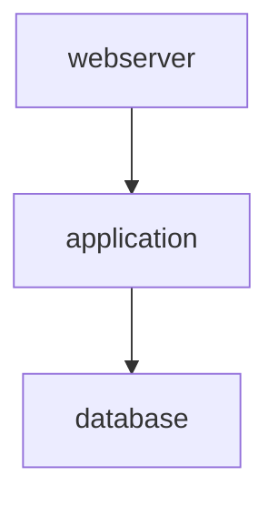

# Ansible Collection Documentation Guide

**Version**: 0.5.0  
**Last Updated**: 2025-11-21

## Table of Contents

- [Overview](#overview)
- [Installation](#installation)
- [Quick Start](#quick-start)
- [Commands](#commands)
  - [collection parse](#collection-parse)
  - [collection generate](#collection-generate)
  - [collection analyze](#collection-analyze)
- [Advanced Usage](#advanced-usage)
- [Configuration](#configuration)
- [Templates](#templates)
- [Troubleshooting](#troubleshooting)
- [Examples](#examples)

---

## Overview

ansible-doctor-enhanced v0.5.0 introduces comprehensive support for **Ansible Collections**, enabling you to:

- **Parse** collection metadata from `galaxy.yml`
- **Generate** professional documentation for collections
- **Analyze** role dependencies and detect circular dependencies
- **Export** dependency graphs in multiple formats (text, JSON, Mermaid)

### What is an Ansible Collection?

An Ansible Collection is a distribution format for Ansible content including roles, modules, plugins, and playbooks. Collections follow a standardized structure:

```
my_namespace.my_collection/
├── galaxy.yml              # Collection metadata
├── roles/                  # Roles directory
│   ├── role1/
│   └── role2/
├── plugins/                # Plugins directory
│   ├── modules/           # Module plugins
│   ├── filter/            # Filter plugins
│   ├── lookup/            # Lookup plugins
│   └── ...
├── playbooks/             # Example playbooks
└── docs/                  # Documentation (generated)
```

## Documentation Features

The generator automatically discovers and documents:

- **Metadata**: Extracts version, authors, and dependencies from `galaxy.yml`.
- **Roles**: Lists all roles with links to their individual documentation.
- **Plugins**: Groups plugins by type (modules, filters, lookups, etc.).
- **Playbooks**: Lists playbooks found in `playbooks/` directory, including descriptions and tags.
- **Existing Docs**: Automatically includes `README.md`, `CHANGELOG.md`, `CONTRIBUTING.md`, and `LICENSE` files in the generated output.

---

## Installation

### Using Poetry (Recommended)

```bash
# Install ansible-doctor-enhanced
poetry add ansible-doctor-enhanced

# Or install from source
git clone https://github.com/yourusername/ansible-doctor-enhanced.git
cd ansible-doctor-enhanced
poetry install
```

### Using pip

```bash
pip install ansible-doctor-enhanced
```

### Verify Installation

```bash
# Using Poetry
poetry run ansible-doctor-enhanced --version

# Using pip
ansible-doctor-enhanced --version
```

---

## Quick Start

### 1. Parse Collection Metadata

Extract metadata from a collection's `galaxy.yml`:

```bash
# Using Poetry
poetry run ansible-doctor-enhanced collection parse ./my_namespace.my_collection

# Output to file
poetry run ansible-doctor-enhanced collection parse ./my_namespace.my_collection --output collection.json --pretty
```

**Output**:
```json
{
  "namespace": "my_namespace",
  "name": "my_collection",
  "version": "1.0.0",
  "authors": ["Author Name <email@example.com>"],
  "dependencies": {
    "ansible.posix": ">=1.0.0",
    "community.general": ">=3.0.0"
  },
  "roles": ["database", "application", "webserver"],
  "plugins": {
    "modules": ["database_backup", "app_deploy", "health_check"],
    "filter": ["formatting", "text", "validation"]
  }
}
```

### 2. Generate Collection Documentation

Create a comprehensive README.md for your collection:

```bash
# Using Poetry
poetry run ansible-doctor-enhanced collection generate ./my_namespace.my_collection

# Specify output directory
poetry run ansible-doctor-enhanced collection generate ./my_namespace.my_collection --output-dir ./docs

# Generate HTML format
poetry run ansible-doctor-enhanced collection generate ./my_namespace.my_collection --format html
```

**Generated Documentation Includes**:
- Collection overview (name, version, description)
- Installation instructions
- Role index with descriptions
- Plugin listing by type
- Dependency requirements
- Example playbooks

### 3. Analyze Role Dependencies

Visualize and validate role dependencies:

```bash
# Using Poetry - Show dependency graph
poetry run ansible-doctor-enhanced collection analyze ./my_namespace.my_collection --show-dependencies

# Check for circular dependencies (exit code 1 if found)
poetry run ansible-doctor-enhanced collection analyze ./my_namespace.my_collection --check-circular

# Export to JSON format
poetry run ansible-doctor-enhanced collection analyze ./my_namespace.my_collection --show-dependencies --output-format json

# Export to Mermaid diagram
poetry run ansible-doctor-enhanced collection analyze ./my_namespace.my_collection --show-dependencies --output-format mermaid
```

---

## Commands

### collection parse

Parse collection metadata and structure.

**Syntax**:
```bash
poetry run ansible-doctor-enhanced collection parse <COLLECTION_PATH> [OPTIONS]
```

**Options**:
- `--output FILE`: Write JSON output to file (default: stdout)
- `--pretty`: Pretty-print JSON output
- `--validate`: Validate collection structure only (no output)

**Examples**:

```bash
# Parse and display metadata
poetry run ansible-doctor-enhanced collection parse ./demo_namespace.demo_collection

# Save to file with pretty formatting
poetry run ansible-doctor-enhanced collection parse ./demo_namespace.demo_collection --output metadata.json --pretty

# Validate collection structure
poetry run ansible-doctor-enhanced collection parse ./demo_namespace.demo_collection --validate
```

**Exit Codes**:
- `0`: Success
- `1`: Parse error (invalid galaxy.yml, missing files)
- `2`: Invalid arguments

---

### collection generate

Generate documentation for an Ansible collection.

**Syntax**:
```bash
poetry run ansible-doctor-enhanced collection generate <COLLECTION_PATH> [OPTIONS]
```

**Options**:
- `--output-dir DIR`: Output directory (default: `docs/`)
- `--format FORMAT`: Output format - `markdown`, `html`, `rst` (default: `markdown`)
- `--template FILE`: Custom Jinja2 template path
- `--config FILE`: Configuration file path

**Examples**:

```bash
# Generate Markdown documentation (default)
poetry run ansible-doctor-enhanced collection generate ./demo_namespace.demo_collection

# Generate HTML documentation
poetry run ansible-doctor-enhanced collection generate ./demo_namespace.demo_collection --format html --output-dir ./html-docs

# Generate RST documentation for Sphinx
poetry run ansible-doctor-enhanced collection generate ./demo_namespace.demo_collection --format rst --output-dir ./sphinx-docs

# Use custom template
poetry run ansible-doctor-enhanced collection generate ./demo_namespace.demo_collection --template ./templates/custom-collection.md.j2
```

**Generated Files**:
- Markdown: `docs/README.md`
- HTML: `docs/README.html`
- RST: `docs/README.rst`

**Exit Codes**:
- `0`: Success
- `1`: Generation error (template error, parse failure)
- `2`: Invalid arguments

---

### collection analyze

Analyze role dependencies within a collection.

**Syntax**:
```bash
poetry run ansible-doctor-enhanced collection analyze <COLLECTION_PATH> [OPTIONS]
```

**Options**:
- `--show-dependencies`: Display dependency graph
- `--check-circular`: Check for circular dependencies (exit 1 if found)
- `--output-format FORMAT`: Export format - `text`, `json`, `mermaid` (default: `text`)

**Examples**:

```bash
# Show dependency tree (ASCII)
poetry run ansible-doctor-enhanced collection analyze ./demo_namespace.demo_collection --show-dependencies

# Check for circular dependencies
poetry run ansible-doctor-enhanced collection analyze ./demo_namespace.demo_collection --check-circular

# Export to JSON
poetry run ansible-doctor-enhanced collection analyze ./demo_namespace.demo_collection --show-dependencies --output-format json

# Export to Mermaid diagram
poetry run ansible-doctor-enhanced collection analyze ./demo_namespace.demo_collection --show-dependencies --output-format mermaid > dependencies.mmd
```

**Output Formats**:

**TEXT (ASCII Tree)**:
```
└── database
    └── application
        └── webserver
```

**JSON**:
```json
{
  "nodes": [
    {
      "name": "database",
      "dependencies": [],
      "dependents": ["application"]
    },
    {
      "name": "application",
      "dependencies": ["database"],
      "dependents": ["webserver"]
    }
  ],
  "edges": [
    {"from": "application", "to": "database"}
  ],
  "circular_dependencies": [],
  "has_cycles": false
}
```

**MERMAID**:


**Exit Codes**:
- `0`: Success (no circular dependencies if `--check-circular`)
- `1`: Circular dependencies found (with `--check-circular`)
- `2`: Invalid arguments

---

## Advanced Usage

### CI/CD Integration

#### Validate Collection Structure

```yaml
# .github/workflows/validate.yml
name: Validate Collection
on: [push, pull_request]

jobs:
  validate:
    runs-on: ubuntu-latest
    steps:
      - uses: actions/checkout@v3
      - uses: actions/setup-python@v4
        with:
          python-version: '3.11'
      - name: Install Poetry
        run: pip install poetry
      - name: Install dependencies
        run: poetry install
      - name: Validate collection
        run: poetry run ansible-doctor-enhanced collection parse . --validate
      - name: Check circular dependencies
        run: poetry run ansible-doctor-enhanced collection analyze . --check-circular
```

#### Generate and Publish Documentation

```yaml
# .github/workflows/docs.yml
name: Generate Documentation
on:
  push:
    branches: [main]

jobs:
  docs:
    runs-on: ubuntu-latest
    steps:
      - uses: actions/checkout@v3
      - uses: actions/setup-python@v4
      - name: Install Poetry
        run: pip install poetry
      - name: Install dependencies
        run: poetry install
      - name: Generate documentation
        run: poetry run ansible-doctor-enhanced collection generate . --output-dir docs
      - name: Deploy to GitHub Pages
        uses: peaceiris/actions-gh-pages@v3
        with:
          github_token: ${{ secrets.GITHUB_TOKEN }}
          publish_dir: ./docs
```

### Pre-commit Hooks

Add validation to your `.pre-commit-config.yaml`:

```yaml
repos:
  - repo: local
    hooks:
      - id: validate-collection
        name: Validate Ansible Collection
        entry: poetry run ansible-doctor-enhanced collection parse . --validate
        language: system
        pass_filenames: false
        
      - id: check-dependencies
        name: Check Circular Dependencies
        entry: poetry run ansible-doctor-enhanced collection analyze . --check-circular
        language: system
        pass_filenames: false
```

### Playbook Documentation

To add descriptions to your playbooks, add a comment starting with `# description:` at the top of the playbook file:

```yaml
# description: Deploys the web application stack
---
- name: Web Stack
  hosts: webservers
  tags: [web, deploy]
  tasks: ...
```

The generator will extract this description and display it in the Playbooks table along with the playbook name and tags.

### Custom Templates

Create custom documentation templates using Jinja2:

**Example: `templates/custom-collection.md.j2`**

```jinja2
# {{ collection.metadata.namespace }}.{{ collection.metadata.name }}

**Version**: {{ collection.metadata.version }}
**Namespace**: {{ collection.metadata.namespace }}

## Roles


- **{{ role }}**: Add description here


## Plugins

### Modules

- `{{ module }}`


### Filters

- `{{ filter }}`


## Installation

```bash
ansible-galaxy collection install {{ collection.metadata.namespace }}.{{ collection.metadata.name }}
```
```

**Usage**:
```bash
poetry run ansible-doctor-enhanced collection generate . --template ./templates/custom-collection.md.j2
```

---

## Configuration

Create a `.ansibledoctor.yml` configuration file:

```yaml
# Collection documentation configuration
collection:
  # Output settings
  output_dir: docs
  output_format: markdown
  
  # Template settings
  template: null  # Path to custom template
  
  # Generation options
  include_role_docs: false  # Include individual role docs (v0.6.0)
  
  # Formatting
  role_index_format: table  # table or list
  
  # Dependency analysis
  check_circular: true
  show_dependencies: true
```

**Usage**:
```bash
poetry run ansible-doctor-enhanced collection generate . --config .ansibledoctor.yml
```

---

## Templates

### Built-in Templates

ansible-doctor-enhanced includes a default collection template at:
```
ansibledoctor/templates/collection.md.j2
```

### Template Variables

Available variables in custom templates:

```jinja2
{
  "collection": {
    "metadata": {
      "namespace": "string",
      "name": "string",
      "version": "string",
      "authors": ["string"],
      "dependencies": {"collection": "version_constraint"}
    },
    "roles": ["role_name"],
    "plugins": {
      "module": ["module_name"],
      "filter": ["filter_name"],
      "lookup": ["lookup_name"]
    }
  }
}
```

### Template Filters

Available Jinja2 filters:

- `markdown_escape`: Escape Markdown special characters
- `format_version`: Format semantic version
- `format_authors`: Format author list

---

## Troubleshooting

### Common Issues

#### 1. "ModuleNotFoundError: No module named 'yaml'"

**Solution**: Install PyYAML using Poetry:
```bash
poetry add pyyaml
```

#### 2. "ModuleNotFoundError: No module named 'jinja2'"

**Solution**: Install Jinja2:
```bash
poetry add jinja2
```

#### 3. "No plugins discovered"

**Cause**: Plugin files may not follow Ansible plugin conventions.

**Solution**: Ensure plugin files:
- Are valid Python files (`.py` extension)
- Include `DOCUMENTATION` string for modules
- Include `FilterModule` class for filters
- Are in correct directories (`plugins/modules/`, `plugins/filter/`)

#### 4. "'charmap' codec can't encode character" (Windows)

**Cause**: Windows console encoding issue with UTF-8 characters.

**Solution**: Already handled in v0.5.0 - ASCII tree output uses binary stream writing.

#### 5. "Circular dependency detected"

**Example**:
```
⚠ Warning: Circular dependencies detected!
Cycle: role_a -> role_b -> role_c -> role_a
```

**Solution**: 
- Review role dependencies in `meta/main.yml`
- Refactor roles to break circular dependencies
- Create a common base role for shared functionality

### Debug Mode

Enable verbose logging:

```bash
# Set log level to DEBUG
export LOG_LEVEL=DEBUG
poetry run ansible-doctor-enhanced collection parse ./my_collection
```

### Reporting Issues

If you encounter bugs, please report with:
1. ansible-doctor-enhanced version
2. Python version
3. Operating system
4. Full error message
5. Minimal reproduction example

---

## Examples

### Example 1: Complete Workflow

```bash
# 1. Parse collection metadata
poetry run ansible-doctor-enhanced collection parse ./demo_namespace.demo_collection --output metadata.json --pretty

# 2. Validate dependencies
poetry run ansible-doctor-enhanced collection analyze ./demo_namespace.demo_collection --check-circular

# 3. Generate documentation
poetry run ansible-doctor-enhanced collection generate ./demo_namespace.demo_collection

# 4. Export dependency graph
poetry run ansible-doctor-enhanced collection analyze ./demo_namespace.demo_collection --show-dependencies --output-format mermaid > dependencies.mmd
```

### Example 2: Automated Documentation Update

**Script: `update-docs.sh`**

```bash
#!/bin/bash
set -e

COLLECTION_PATH="./my_namespace.my_collection"

echo "Validating collection..."
poetry run ansible-doctor-enhanced collection parse "$COLLECTION_PATH" --validate

echo "Checking for circular dependencies..."
poetry run ansible-doctor-enhanced collection analyze "$COLLECTION_PATH" --check-circular

echo "Generating documentation..."
poetry run ansible-doctor-enhanced collection generate "$COLLECTION_PATH" --output-dir docs

echo "Exporting dependency graph..."
poetry run ansible-doctor-enhanced collection analyze "$COLLECTION_PATH" --show-dependencies --output-format mermaid > docs/dependencies.mmd

echo "✓ Documentation updated successfully!"
```

### Example 3: Multi-Format Documentation

```bash
# Generate all formats
COLLECTION="./my_namespace.my_collection"

poetry run ansible-doctor-enhanced collection generate "$COLLECTION" --format markdown --output-dir docs/markdown
poetry run ansible-doctor-enhanced collection generate "$COLLECTION" --format html --output-dir docs/html
poetry run ansible-doctor-enhanced collection generate "$COLLECTION" --format rst --output-dir docs/rst
```

---

## Demo Collection

A comprehensive demo collection is included in the repository:

```
demo/demo_namespace.demo_collection/
├── galaxy.yml
├── roles/
│   ├── database/       (no dependencies)
│   ├── application/    (depends on: database)
│   └── webserver/      (depends on: application)
├── plugins/
│   ├── modules/
│   │   ├── database_backup.py
│   │   ├── app_deploy.py
│   │   ├── ssl_cert_info.py
│   │   ├── nginx_config_test.py
│   │   └── health_check.py
│   └── filter/
│       ├── formatting.py
│       ├── text.py
│       └── validation.py
└── playbooks/
    ├── deploy_stack.yml
    ├── database_maintenance.yml
    └── app_deployment.yml
```

**Try it**:
```bash
cd demo/demo_namespace.demo_collection

# Parse metadata
poetry run ansible-doctor-enhanced collection parse .

# Analyze dependencies
poetry run ansible-doctor-enhanced collection analyze . --show-dependencies

# Generate documentation
poetry run ansible-doctor-enhanced collection generate .
```

---

## Next Steps

- Read the [Configuration Guide](CONFIG_GUIDE.md) for advanced options
- Review the [Annotation Guide](ANNOTATION_GUIDE.md) for role documentation
- Check the [Template Guide](TEMPLATE_GUIDE.md) for customization
- See the [CHANGELOG](../CHANGELOG.md) for version history

---

## Support

- **Issues**: https://github.com/yourusername/ansible-doctor-enhanced/issues
- **Documentation**: https://github.com/yourusername/ansible-doctor-enhanced/docs
- **Discussions**: https://github.com/yourusername/ansible-doctor-enhanced/discussions

---

*Generated by ansible-doctor-enhanced v0.5.0*
