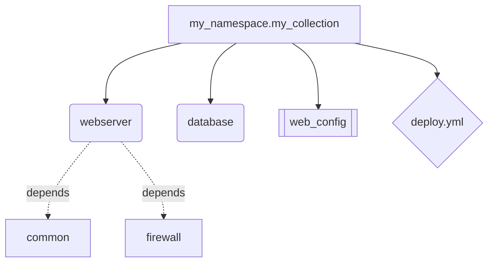
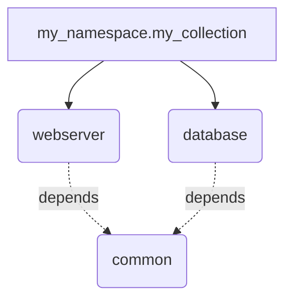

# Index Generation Guide

## Overview

Ansible Doctor Enhanced provides comprehensive index generation and navigation structures for Ansible collections and projects. This guide demonstrates all index formats, embedded sections, filtering capabilities, and visualization options.

## Table of Contents

- [Quick Start](#quick-start)
- [Index Formats](#index-formats)
  - [List Format](#list-format)
  - [Table Format](#table-format)
  - [Tree Format](#tree-format)
  - [Nested Table Format](#nested-table-format)
  - [Diagram Format (Mermaid)](#diagram-format-mermaid)
- [Embedded Section Indexes](#embedded-section-indexes)
- [Filtering](#filtering)
- [CLI Reference](#cli-reference)
- [Examples](#examples)

## Quick Start

Generate indexes for your Ansible collection:

```bash
# Basic index generation (list format)
ansible-doctor-enhanced collection generate ./my_namespace.my_collection --include-index

# Tree format with hierarchical structure
ansible-doctor-enhanced collection generate ./my_namespace.my_collection \
    --include-index --index-style tree --index-depth 3

# Nested table format
ansible-doctor-enhanced collection generate ./my_namespace.my_collection \
    --include-index --index-style nested-table --nested-depth 2

# Mermaid diagram visualization
ansible-doctor-enhanced collection generate ./my_namespace.my_collection \
    --include-index --index-style diagram

# With filtering
ansible-doctor-enhanced collection generate ./my_namespace.my_collection \
    --include-index --index-style table \
    --filter 'tag:web' --filter 'namespace:my_namespace'
```

## Index Formats

### List Format

The default format displays components as a bulleted list with descriptions, tags, and dependencies.

**CLI:**
```bash
ansible-doctor-enhanced collection generate ./collection --include-index --index-style list
```

**Output Structure:**
- Component name (linked to documentation)
- Description
- Tags (as inline code)
- Dependencies (bulleted list)
- Used by (reverse dependencies)
- Custom metadata

**Example Output:**
```markdown
# Roles Index

## [webserver](docs/roles/webserver.md)

Deploy and configure a web server with Nginx or Apache.

**Tags:** `web`, `nginx`, `apache`

**Dependencies:**
- common
- firewall

---

## [database](docs/roles/database.md)

Deploy PostgreSQL or MySQL database servers.

**Tags:** `database`, `postgres`, `mysql`

---
```

### Table Format

Displays components in a compact table with Name, Description, Tags, and Dependencies columns.

**CLI:**
```bash
ansible-doctor-enhanced collection generate ./collection --include-index --index-style table
```

**Output Structure:**
| Column | Content |
|--------|---------|
| Name | Component name (linked) |
| Description | Truncated to 80 characters |
| Tags | Comma-separated inline code |
| Dependencies | Comma-separated list |

**Example Output:**
```markdown
# Roles Index

| Name | Description | Tags | Dependencies |
|------|-------------|------|--------------|
| [webserver](docs/roles/webserver.md) | Deploy and configure a web server with Nginx or Apache. | `web`, `nginx` | common, firewall |
| [database](docs/roles/database.md) | Deploy PostgreSQL or MySQL database servers. | `database`, `postgres` | - |
```

### Tree Format

Hierarchical visualization using ASCII/Unicode box-drawing characters showing parent-child relationships.

**CLI:**
```bash
ansible-doctor-enhanced collection generate ./collection \
    --include-index --index-style tree --index-depth 5
```

**Parameters:**
- `--index-depth`: Maximum tree depth (default: 5, use 0 for unlimited)

**Output Structure:**
```
my_namespace.my_collection
├── roles
│   ├── webserver
│   │   └── dependencies: common, firewall
│   └── database
└── plugins
    ├── modules
    │   ├── web_config
    │   └── db_backup
    └── filters
        └── format_json
```

**Example Output:**
```markdown
# Project Index

```
Collection: my_namespace.my_collection
├── Role: webserver (tags: web, nginx)
│   ├── Dependencies: common, firewall
│   └── Used by: app_server
├── Role: database (tags: database, postgres)
└── Plugin: web_config (type: module)
```

## Component Details

### webserver
- **Type:** role
- **Path:** `roles/webserver`
- **Namespace:** `my_namespace`
- **Tags:** `web`, `nginx`, `apache`
- **Dependencies:** common, firewall
```

### Nested Table Format

Shows collections as rows with inline display of their child components (roles, plugins, playbooks).

**CLI:**
```bash
ansible-doctor-enhanced collection generate ./collection \
    --include-index --index-style nested-table --nested-depth 2
```

**Parameters:**
- `--nested-depth`: Maximum nesting depth (default: 2)

**Output Structure:**
- Collection row: Collection | Namespace | Roles Count | Plugins Count | Description
- Children rows: ↳ **Roles:** comma-separated names
- Children rows: ↳ **Plugins:** comma-separated names
- Children rows: ↳ **Playbooks:** comma-separated names

**Example Output:**
```markdown
# Collections Overview

| Collection | Namespace | Roles | Plugins | Description |
|------------|-----------|-------|---------|-------------|
| [my_collection](docs/index.md) | my_namespace | 5 | 8 | Web infrastructure collection |
| ↳ **Roles:** | | webserver, database, cache, loadbalancer, monitoring | | |
| ↳ **Plugins:** | | web_config, db_backup, cache_clear, lb_check | | |
| ↳ **Playbooks:** | | deploy.yml, rollback.yml | | |
```

### Diagram Format (Mermaid)

Visual flowchart or mindmap using Mermaid diagram syntax. Supports clickable nodes linking to documentation.

**CLI:**
```bash
ansible-doctor-enhanced collection generate ./collection --include-index --index-style diagram
```

**Flowchart Features:**
- Type-specific node shapes:
  - Collections: `[name]` (rectangle)
  - Roles: `(name)` (rounded rectangle)
  - Plugins/Modules: `[[name]]` (subroutine)
  - Playbooks: `{name}` (rhombus)
- Parent-child relationships: `parent --> child`
- Dependency arrows: `component -.depends.-> dependency`
- Clickable nodes: `click node_id "doc_link"`

**Example Output:**
````markdown
# Project Structure Diagram



## Component Details

### webserver
- **Type:** role
- **Path:** `roles/webserver`
- **Tags:** web, nginx, apache
- **Dependencies:** common, firewall
````

## Embedded Section Indexes

Use the `{{ index() }}` function in Jinja2 templates to embed indexes anywhere in your documentation.

### Template Function Signature

```jinja
{{ index(component_type, format='list', limit=None, filter=None, group_by=None, **kwargs) }}
```

### Parameters

| Parameter | Type | Default | Description |
|-----------|------|---------|-------------|
| `component_type` | str | (required) | Type of components: 'roles', 'plugins', 'modules' |
| `format` | str | 'list' | Display format: 'list', 'table', 'tree' |
| `limit` | int | None | Maximum items to show (adds "and X more..." message) |
| `filter` | str | None | Filter string (e.g., 'tag:web') |
| `group_by` | str | None | Group by field (e.g., 'metadata.plugin_type') |

### Examples

**Basic List:**
```jinja
## Available Roles

{{ index('roles') }}
```

**Table Format with Limit:**
```jinja
## Top 5 Plugins

{{ index('plugins', format='table', limit=5) }}
```

**Filtered by Tag:**
```jinja
## Web Components

{{ index('roles', filter='tag:web') }}
```

**Grouped by Plugin Type:**
```jinja
## Plugins by Type

{{ index('plugins', format='table', group_by='metadata.plugin_type') }}
```

**Combined Parameters:**
```jinja
## Recent Web Modules (Top 10)

{{ index('modules', format='table', filter='tag:web', limit=10) }}
```

### Output Examples

**List Format (limit=2):**
```markdown
- [webserver](docs/roles/webserver.md) - Deploy and configure a web server
- [database](docs/roles/database.md) - Deploy PostgreSQL database

... and 3 more roles
```

**Table Format (group_by='metadata.plugin_type'):**
```markdown
### module

| Name | Description |
|------|-------------|
| [web_config](docs/plugins/web_config.md) | Configure web server |

### filter

| Name | Description |
|------|-------------|
| [format_json](docs/plugins/format_json.md) | Format JSON output |
```

## Filtering

Filter index results by tag, namespace, type, or custom metadata fields.

### Filter Syntax

```bash
--filter 'field:value'
```

### Supported Fields

| Field | Description | Example |
|-------|-------------|---------|
| `tag` | Component tags | `tag:web` |
| `namespace` | Ansible namespace | `namespace:my_namespace` |
| `type` | Component type | `type:role` |
| `metadata.*` | Custom metadata | `metadata.plugin_type:module` |

### Multiple Filters (AND Logic)

Apply multiple filters sequentially - all must match:

```bash
ansible-doctor-enhanced collection generate ./collection \
    --include-index --index-style table \
    --filter 'tag:web' \
    --filter 'namespace:my_namespace'
```

### Filter Examples

**By Tag:**
```bash
--filter 'tag:database'
# Shows only components tagged with 'database'
```

**By Namespace:**
```bash
--filter 'namespace:community'
# Shows only components in 'community' namespace
```

**By Type:**
```bash
--filter 'type:role'
# Shows only roles, excludes plugins/modules
```

**Multiple Filters:**
```bash
--filter 'tag:web' --filter 'type:role'
# Shows only roles tagged with 'web'
```

**Custom Metadata:**
```bash
--filter 'metadata.plugin_type:module'
# Shows only plugins with plugin_type=module
```

### Empty Filter Results

When no components match filters, a helpful message is displayed:

```markdown
*No roles found matching the specified filters.*

Try adjusting your filter criteria or removing filters to see all roles.
```

## CLI Reference

### Collection Generation

```bash
ansible-doctor-enhanced collection generate <path> [options]
```

#### Index Options

| Flag | Type | Default | Description |
|------|------|---------|-------------|
| `--include-index` | flag | false | Enable index generation |
| `--index-style` | choice | 'list' | Format: list, table, tree, nested-table, diagram |
| `--index-format` | choice | 'full' | Page format: full (standalone) or section (embedded) |
| `--index-depth` | int | 5 | Maximum tree depth (0=unlimited) |
| `--nested-depth` | int | 2 | Nesting depth for nested-table format |
| `--filter` | str | (none) | Filter by field:value (multiple allowed) |

#### Format Choices

- `list`: Bulleted list with descriptions (default)
- `table`: Compact table view
- `tree`: Hierarchical tree with ASCII art
- `nested-table`: Collections with inline children
- `diagram`: Mermaid flowchart or mindmap

#### Page Format Choices

- `full`: Generate standalone index pages (default)
- `section`: Generate embedded section indexes

### Examples

**All Index Formats:**
```bash
# List (default)
ansible-doctor-enhanced collection generate ./collection --include-index

# Table
ansible-doctor-enhanced collection generate ./collection --include-index --index-style table

# Tree with custom depth
ansible-doctor-enhanced collection generate ./collection --include-index --index-style tree --index-depth 3

# Nested table with custom depth
ansible-doctor-enhanced collection generate ./collection --include-index --index-style nested-table --nested-depth 2

# Mermaid diagram
ansible-doctor-enhanced collection generate ./collection --include-index --index-style diagram
```

**With Filtering:**
```bash
# Single filter
ansible-doctor-enhanced collection generate ./collection \
    --include-index --index-style table \
    --filter 'tag:web'

# Multiple filters (AND logic)
ansible-doctor-enhanced collection generate ./collection \
    --include-index --index-style table \
    --filter 'tag:web' \
    --filter 'namespace:my_namespace'
```

**Embedded Section Indexes:**
```bash
# Generate embedded indexes for use with {{ index() }} function
ansible-doctor-enhanced collection generate ./collection \
    --include-index --index-format section
```

## Examples

### Example 1: Simple Role Index

```bash
ansible-doctor-enhanced collection generate ./my_namespace.my_collection \
    --include-index --index-style list --output-dir ./docs
```

**Output:** `docs/roles/index.md`
```markdown
# Roles Index

## [webserver](webserver.md)

Deploy and configure a web server with Nginx or Apache.

**Tags:** `web`, `nginx`, `apache`

## [database](database.md)

Deploy PostgreSQL or MySQL database servers.

**Tags:** `database`, `postgres`, `mysql`
```

### Example 2: Hierarchical Project Tree

```bash
ansible-doctor-enhanced collection generate ./my_namespace.my_collection \
    --include-index --index-style tree --index-depth 3
```

**Output:** Shows nested structure with max 3 levels:
```
my_namespace.my_collection
├── webserver (role)
│   └── dependencies: common, firewall
├── database (role)
└── web_config (plugin:module)
```

### Example 3: Filtered Table View

```bash
ansible-doctor-enhanced collection generate ./my_namespace.my_collection \
    --include-index --index-style table \
    --filter 'tag:web'
```

**Output:** Only web-tagged components:
```markdown
| Name | Description | Tags | Dependencies |
|------|-------------|------|--------------|
| [webserver](docs/roles/webserver.md) | Deploy web server | `web`, `nginx` | common |
```

### Example 4: Embedded Indexes in Collection README

**Template:** `collection-readme.md.j2`
```jinja
# {{ collection_name }} Collection

## Available Roles

{{ index('roles', format='table') }}

## Web Infrastructure Components

{{ index('roles', format='list', filter='tag:web', limit=5) }}

## Plugins by Type

{{ index('plugins', format='table', group_by='metadata.plugin_type') }}
```

**Generate:**
```bash
ansible-doctor-enhanced collection generate ./my_namespace.my_collection \
    --template ./templates/collection-readme.md.j2 \
    --include-index --index-format section
```

### Example 5: Mermaid Diagram with Dependencies

```bash
ansible-doctor-enhanced collection generate ./my_namespace.my_collection \
    --include-index --index-style diagram
```

**Output:** Visual flowchart showing relationships:
````markdown

````

## Best Practices

### Choosing Index Formats

| Use Case | Recommended Format | Why |
|----------|-------------------|-----|
| Quick reference | **list** | Easy to scan, full descriptions |
| Compact overview | **table** | Space-efficient, multiple columns |
| Complex hierarchy | **tree** | Shows parent-child relationships |
| Collection summary | **nested-table** | Inline display of children |
| Visual documentation | **diagram** | Interactive, clickable flowchart |

### Performance Considerations

- Use `--index-depth` to limit tree recursion for large projects
- Apply `--filter` to reduce output for focused documentation
- Use `limit` parameter in embedded indexes to show top N items
- Mermaid diagrams work best with < 100 nodes (use filtering for larger projects)

### Template Best Practices

- Use `format='table'` for compact inline displays
- Use `limit` to show "top 5" or "recent 10" lists
- Combine `filter` and `group_by` for organized sections
- Add descriptive headers before `{{ index() }}` calls

### Filter Best Practices

- Use specific filters to reduce noise: `tag:production` instead of showing everything
- Combine filters for precise results: `--filter 'tag:web' --filter 'type:role'`
- Document filter criteria in your README so users know what's included/excluded

## Troubleshooting

### No Components Found

**Message:** `*No roles found.*`

**Solutions:**
- Verify collection structure: roles should be in `roles/` directory
- Check `--filter` criteria - too restrictive filters may exclude everything
- Ensure metadata is correctly parsed (check for YAML syntax errors)

### Empty Filter Results

**Message:** `*No roles found matching the specified filters.*`

**Solutions:**
- Review filter syntax: `field:value` (no spaces around colon)
- Check component tags in metadata (e.g., `galaxy_tags` in `meta/main.yml`)
- Try removing filters one at a time to identify which is too restrictive
- Use `--index-style list` without filters to see all available components first

### Mermaid Diagram Not Rendering

**Issue:** Diagram shows as raw text instead of rendering.

**Solutions:**
- Ensure your documentation platform supports Mermaid (GitHub, GitLab, VS Code with extension)
- Check for syntax errors in generated diagram code
- For large diagrams (>100 nodes), use `--filter` to reduce complexity

### Tree Depth Too Deep

**Issue:** Tree visualization is overwhelming.

**Solutions:**
- Use `--index-depth 3` to limit to 3 levels
- Apply `--filter` to reduce component count
- Consider `nested-table` format for a more compact view

## Related Documentation

- [Template Guide](TEMPLATE_GUIDE.md) - Custom templates and Jinja2 usage
- [Collection Guide](COLLECTION_GUIDE.md) - Working with Ansible collections
- [Annotation Guide](ANNOTATION_GUIDE.md) - Metadata annotation syntax
- [Configuration Guide](CONFIG_GUIDE.md) - Configuration file options

## Support

For issues, feature requests, or questions:
- GitHub Issues: https://github.com/thegeeklab/ansible-doctor-enhanced/issues
- Documentation: https://github.com/thegeeklab/ansible-doctor-enhanced/tree/main/docs

---

**Version:** 0.5.0  
**Last Updated:** 2024  
**Feature:** Spec 011 - Indexes & Navigation
