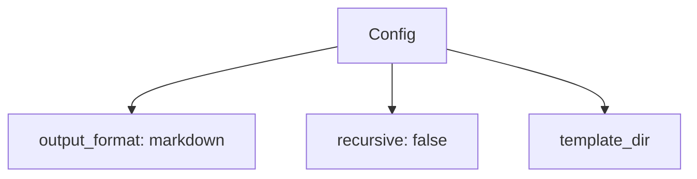

# Schema Validation & Documentation Guide

Complete guide to using ansible-doctor's schema validation, export, conversion, and documentation features.

**Spec 012**: Schema Documentation & Validation

## Table of Contents

- [Overview](#overview)
- [Configuration Validation](#configuration-validation)
- [Schema Export](#schema-export)
- [Format Conversion](#format-conversion)
- [Data Model Validation](#data-model-validation)
- [Schema Documentation](#schema-documentation)
- [IDE Integration](#ide-integration)
- [Troubleshooting](#troubleshooting)

## Overview

Ansible-doctor provides comprehensive schema validation and documentation capabilities:

- **Configuration Validation**: Validate `.ansibledoctor.yml` files against JSON Schema
- **Schema Export**: Export schemas for IDE autocomplete integration
- **Format Conversion**: Convert between YAML, JSON, XML, and Mermaid diagrams
- **Data Model Validation**: Validate role and collection data against pydantic models
- **Schema Documentation**: Generate human-readable Markdown from schemas

All schema operations are available via the `schema` command group:

```bash
python -m ansibledoctor schema --help
```

## Configuration Validation

Validate your configuration files to catch errors early.

### Basic Validation

Validate a configuration file:

```bash
python -m ansibledoctor schema validate .ansibledoctor.yml
```

Output:
```
✓ Configuration is valid
```

### Strict Mode

Treat warnings as errors:

```bash
python -m ansibledoctor schema validate .ansibledoctor.yml --strict
```

### Verbose Output

Show detailed error messages with suggestions:

```bash
python -m ansibledoctor schema validate .ansibledoctor.yml --verbose
```

### Example Errors

**Missing required property**:
```
✗ Configuration validation failed
  1 error(s):
    - output_format: Field required
      Suggestion: Add 'output_format' property (allowed: markdown, html, rst)
```

**Invalid enum value**:
```
✗ Configuration validation failed
  1 error(s):
    - output_format: Input should be 'markdown', 'html' or 'rst'
      Suggestion: Use one of the allowed values: markdown, html, rst
```

## Schema Export

Export JSON Schema definitions for IDE integration and documentation.

### Export to stdout

```bash
python -m ansibledoctor schema export config
```

### Export to file

```bash
python -m ansibledoctor schema export config --output config-schema.json
```

### OpenAPI Format

Export as OpenAPI 3.1 specification:

```bash
python -m ansibledoctor schema export config --format openapi --output openapi.yaml
```

### What Gets Exported

- **JSON Schema Draft 2020-12** format
- Type definitions for all properties
- Required fields marked
- Enum constraints
- Default values
- Descriptions and examples
- `$schema` and `$id` for IDE recognition

## Format Conversion

Convert configuration files between different formats.

### YAML to JSON

```bash
python -m ansibledoctor schema convert .ansibledoctor.yml --to json
```

With pretty formatting:

```bash
python -m ansibledoctor schema convert .ansibledoctor.yml --to json --pretty
```

### YAML to XML

```bash
python -m ansibledoctor schema convert .ansibledoctor.yml --to xml --output config.xml
```

### Generate Mermaid Diagram

Visualize configuration structure:

```bash
python -m ansibledoctor schema convert .ansibledoctor.yml --to mermaid --output diagram.mmd
```

Output example:


### Supported Formats

- **YAML** (`.yml`, `.yaml`)
- **JSON** (`.json`)
- **XML** (`.xml`)
- **Mermaid** (`.mmd`) - Diagram generation only

## Data Model Validation

Validate role and collection data against pydantic models.

### Validate Role Data

```bash
python -m ansibledoctor schema validate-model role role_data.yml
```

Success output:
```
✓ Role data is valid
```

### Validate Collection Metadata

```bash
python -m ansibledoctor schema validate-model collection galaxy.yml
```

### Strict Validation

Treat warnings as errors:

```bash
python -m ansibledoctor schema validate-model role role.yml --strict-validation
```

Example warning in strict mode:
```
✗ Role data validation failed
  1 warning(s):
    - metadata.description: Description is recommended but missing or empty
  Strict mode: Warnings treated as errors
```

### Verbose Output

Show detailed error messages:

```bash
python -m ansibledoctor schema validate-model role role.yml --verbose
```

### Common Validation Errors

**Missing required field**:
```
✗ Role data validation failed
  1 error(s):
    - name: Field required
```

**Invalid type**:
```
✗ Role data validation failed
  1 error(s):
    - metadata.platforms: Input should be a valid list
```

**Invalid dependency format**:
```
✓ Collection data is valid
  1 warning(s):
    - metadata.dependencies.invalid_dep: Dependency 'invalid_dep' should follow FQCN format 'namespace.name'
```

## Schema Documentation

Generate human-readable Markdown documentation from schemas.

### Generate Documentation

```bash
python -m ansibledoctor schema docs config
```

### Save to File

```bash
python -m ansibledoctor schema docs config --output schema-docs.md
```

### Generated Documentation Includes

- Schema title and description
- Property sections with types
- Required vs optional fields
- Default values
- Enum constraints with all values
- Nested object properties
- Deprecation warnings
- Examples

Example output:
```markdown
# ConfigModel

Configuration model for .ansibledoctor.yml files.

## Properties

### `output_format` *(required)*

**Type**: `string`

Documentation format (markdown, html, or rst).

**Allowed values**:
- `markdown`
- `html`
- `rst`

**Default**: `markdown`
```

## IDE Integration

Configure your IDE for autocomplete and validation.

### VS Code

Create `.vscode/settings.json`:

```json
{
  "yaml.schemas": {
    "./config-schema.json": ".ansibledoctor.yml"
  }
}
```

Steps:
1. Export schema: `python -m ansibledoctor schema export config --output config-schema.json`
2. Create VS Code settings
3. Open `.ansibledoctor.yml` - autocomplete and validation active!

### IntelliJ IDEA / PyCharm

1. Export schema: `python -m ansibledoctor schema export config --output config-schema.json`
2. Go to **Settings** → **Languages & Frameworks** → **Schemas and DTDs** → **JSON Schema Mappings**
3. Add mapping:
   - **Schema file**: `config-schema.json`
   - **Schema version**: JSON Schema version 7
   - **File path pattern**: `.ansibledoctor.yml`

### Benefits

- **Autocomplete**: Property suggestions as you type
- **Validation**: Real-time error highlighting
- **Documentation**: Hover tooltips with descriptions
- **Enum values**: Dropdown for allowed values

## Troubleshooting

### Validation Fails on Valid Config

**Problem**: Config works but validation fails

**Solution**: Check for:
- Extra properties not in schema (use `--verbose` for details)
- Type mismatches (string vs integer)
- Missing required fields

### Schema Export Fails

**Problem**: `Error exporting schema`

**Solution**:
- Ensure output directory exists
- Check write permissions
- Verify schema type is supported (`config` only in v0.5.0)

### Format Conversion Issues

**Problem**: Conversion produces incorrect output

**Solution**:
- Check source file is valid YAML/JSON
- Use `--pretty` for readable output
- Verify target format is supported
- XML conversion may not preserve all YAML features

### IDE Autocomplete Not Working

**Problem**: No autocomplete in IDE

**Solution**:
1. Verify schema file exists and is valid JSON
2. Check IDE settings for JSON Schema mapping
3. Restart IDE after configuration
4. Ensure file pattern matches (e.g., `.ansibledoctor.yml`)
5. Check IDE supports JSON Schema Draft 2020-12

### Performance Issues

**Problem**: Validation is slow on large configs

**Solution**:
- Schema validation should be fast (< 10ms for typical configs)
- If slow, check for:
  - Large nested structures
  - Many repeated validations
  - File I/O issues

For questions or issues, see the main README or open an issue on GitHub.

## Advanced Usage

### Batch Validation

Validate multiple config files:

```bash
for file in configs/*.yml; do
    python -m ansibledoctor schema validate "$file"
done
```

### CI/CD Integration

Add to CI pipeline:

```yaml
# .github/workflows/validate.yml
- name: Validate Configuration
  run: |
    python -m ansibledoctor schema validate .ansibledoctor.yml --strict
```

### Pre-commit Hook

Add to `.pre-commit-config.yaml`:

```yaml
- repo: local
  hooks:
    - id: validate-config
      name: Validate ansible-doctor config
      entry: python -m ansibledoctor schema validate
      language: system
      files: \.ansibledoctor\.yml$
```

### Custom Validation Scripts

```python
from ansibledoctor.validation import ConfigurationValidator

validator = ConfigurationValidator()
result = validator.validate_file(".ansibledoctor.yml", strict=True)

if not result.is_valid:
    print(result.format_report(verbose=True))
    exit(1)
```

## See Also

- [README.md](../README.md) - Main documentation
- [CONFIG_GUIDE.md](CONFIG_GUIDE.md) - Configuration reference
- [SCHEMA_VALIDATION_GUIDE.md](SCHEMA_VALIDATION_GUIDE.md) - Detailed validation guide
- [ERROR_CODES.md](ERROR_CODES.md) - Error reference
