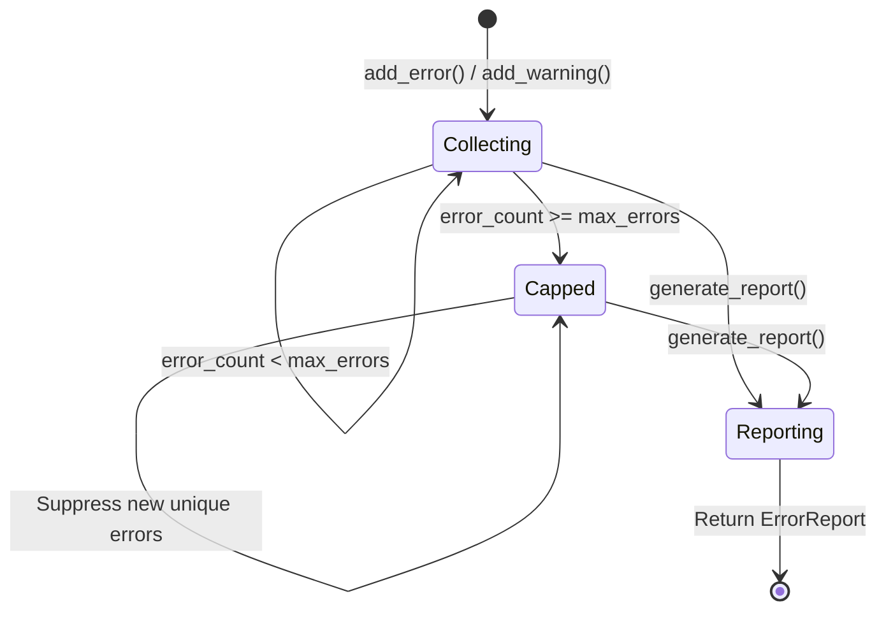
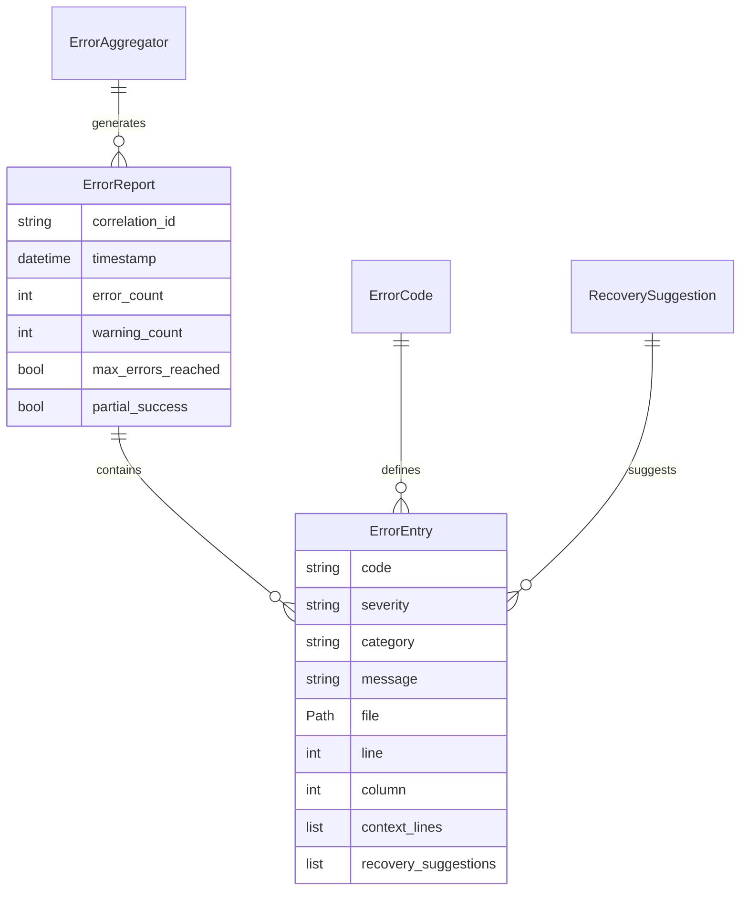

# Data Model: Error Reports & Recovery

**Date**: 2025-12-03  
**Feature**: Spec 010 - Error Reports & Recovery

## Overview

This document defines the data models for error reporting, error codes, recovery suggestions, and IDE integration formats.

---

## Core Models

### ErrorReport

**Purpose**: Aggregated error report for a single execution run.

**Schema**:

```python
from pydantic import BaseModel, Field
from datetime import datetime
from pathlib import Path

class ErrorReport(BaseModel):
    """Aggregated error report with context and suggestions."""
    
    correlation_id: str = Field(
        description="Links to ExecutionReport from Spec 009"
    )
    timestamp: datetime = Field(
        description="When report was generated (ISO 8601)"
    )
    errors: list[ErrorEntry] = Field(
        default_factory=list,
        description="All collected errors"
    )
    warnings: list[ErrorEntry] = Field(
        default_factory=list,
        description="All collected warnings"
    )
    error_count: int = Field(
        description="Total error count (including suppressed)"
    )
    warning_count: int = Field(
        description="Total warning count"
    )
    max_errors_reached: bool = Field(
        default=False,
        description="True if error cap (1000) was reached"
    )
    partial_success: bool = Field(
        default=False,
        description="True if some files processed successfully despite errors"
    )
    
    def to_text(self) -> str:
        """Format report as human-readable text for terminal."""
        ...
    
    def to_json(self) -> str:
        """Serialize report to JSON."""
        return self.model_dump_json(indent=2)
    
    def to_sarif(self) -> dict:
        """Convert report to SARIF 2.1.0 format."""
        ...
```

**Relationships**:

- Links to `ExecutionReport` via `correlation_id` (Spec 009)
- Contains multiple `ErrorEntry` instances
- Consumed by `SARIFFormatter` for IDE output

**Validation Rules**:

- `correlation_id`: Must be valid UUID4 or ULID
- `error_count` >= `len(errors)` (may include suppressed errors)
- `max_errors_reached`: True only if `error_count > 1000`

---

### ErrorEntry

**Purpose**: Single error or warning with full context.

**Schema**:

```python
class ErrorEntry(BaseModel):
    """Single error with location, message, and recovery suggestions."""
    
    code: str = Field(
        pattern=r"^[EW]\d{3}$",
        description="Error code (E101, W201, etc.)"
    )
    severity: Literal["error", "warning"] = Field(
        description="Error severity level"
    )
    category: str = Field(
        description="Error category: parsing, validation, generation, io"
    )
    message: str = Field(
        description="Human-readable error message"
    )
    file: Path | None = Field(
        default=None,
        description="File where error occurred"
    )
    line: int | None = Field(
        default=None,
        ge=1,
        description="Line number (1-indexed)"
    )
    column: int | None = Field(
        default=None,
        ge=1,
        description="Column number (1-indexed)"
    )
    context_lines: list[str] = Field(
        default_factory=list,
        description="Source lines around error location"
    )
    recovery_suggestions: list[str] = Field(
        default_factory=list,
        description="Ordered list of recovery suggestions"
    )
    related_errors: list[str] = Field(
        default_factory=list,
        description="Related error codes to check"
    )
    
    @property
    def hash(self) -> str:
        """Unique hash for deduplication."""
        import hashlib
        key = f"{self.code}:{self.file}:{self.line}:{self.message}"
        return hashlib.sha256(key.encode()).hexdigest()[:16]
```

**Validation Rules**:

- `code`: Must match `ErrorCode` enum
- `severity`: "error" for E-codes, "warning" for W-codes
- `category`: Must be one of: parsing, validation, generation, io
- `context_lines`: Max 5 lines (2 before, error line, 2 after)

---

### ErrorCode

**Purpose**: Enumeration of all error and warning codes.

**Schema**:

```python
from enum import Enum

class ErrorCode(str, Enum):
    """Hierarchical error codes with descriptions."""
    
    # Parsing Errors (E1xx)
    E101 = "YAML syntax error"
    E102 = "Invalid metadata structure"
    E103 = "Unsupported Ansible version"
    E104 = "Invalid task syntax"
    E105 = "Circular role dependency"
    
    # Validation Errors (E2xx)
    E201 = "Missing required annotation"
    E202 = "Invalid annotation syntax"
    E203 = "Duplicate annotation key"
    E204 = "Invalid annotation value"
    E205 = "Conflicting annotations"
    
    # Generation Errors (E3xx)
    E301 = "Template rendering failed"
    E302 = "Output file write error"
    E303 = "Invalid output format"
    E304 = "Unsupported template variable"
    E305 = "Template syntax error"
    
    # I/O Errors (E4xx)
    E401 = "File not found"
    E402 = "Permission denied"
    E403 = "Invalid path"
    E404 = "Directory not found"
    E405 = "Disk full"
    
    # Parsing Warnings (W1xx)
    W101 = "Deprecated YAML syntax"
    W102 = "Unused variable"
    W103 = "Empty metadata block"
    
    # Validation Warnings (W2xx)
    W201 = "Missing recommended annotation"
    W202 = "Deprecated annotation syntax"
    W203 = "Annotation could be more specific"
    
    # Generation Warnings (W3xx)
    W301 = "Output file already exists"
    W302 = "Large output file (>10MB)"
    W303 = "Template using deprecated filter"
    
    # I/O Warnings (W4xx)
    W401 = "File ignored (no matching pattern)"
    W402 = "Symlink detected"
    
    @property
    def category(self) -> str:
        """Extract category from code."""
        prefix = self.name[1]  # E1xx -> "1"
        return {
            "1": "parsing",
            "2": "validation",
            "3": "generation",
            "4": "io",
        }[prefix]
    
    @property
    def severity(self) -> str:
        """Extract severity from code prefix."""
        return "error" if self.name.startswith("E") else "warning"
```

**Extension Strategy**:

- Add new codes in gaps (E106, E107) or at end (E199)
- Never reuse retired codes (mark as deprecated)
- Document all changes in CHANGELOG

---

### RecoverySuggestion

**Purpose**: Maps error codes to recovery actions.

**Schema**:

```python
class RecoverySuggestion(BaseModel):
    """Recovery suggestions for a specific error code."""
    
    error_code: str = Field(
        pattern=r"^[EW]\d{3}$"
    )
    primary_suggestion: str = Field(
        description="Main recovery action to try first"
    )
    alternative_suggestions: list[str] = Field(
        default_factory=list,
        description="Additional recovery options"
    )
    documentation_link: str | None = Field(
        default=None,
        description="Link to relevant documentation"
    )
    auto_fixable: bool = Field(
        default=False,
        description="Whether error can be auto-fixed (future)"
    )
    related_codes: list[str] = Field(
        default_factory=list,
        description="Other error codes to check"
    )
```

**Example Database**:

```python
RECOVERY_SUGGESTIONS = {
    "E101": RecoverySuggestion(
        error_code="E101",
        primary_suggestion="Check YAML indentation. Ansible requires 2-space indents.",
        alternative_suggestions=[
            "Validate YAML syntax with `yamllint tasks/main.yml`",
            "Check for tabs (YAML requires spaces)",
            "Ensure quotes around strings with special characters (: [ ] { })",
        ],
        documentation_link="https://docs.ansible.com/ansible/latest/reference_appendices/YAMLSyntax.html",
        auto_fixable=False,
        related_codes=["E102", "E104"],
    ),
    "E201": RecoverySuggestion(
        error_code="E201",
        primary_suggestion="Add required @meta annotation to file header",
        alternative_suggestions=[
            "Example: @meta description: Role configures web server",
            "See documentation for required annotations",
            "Check spec for minimum annotation requirements",
        ],
        documentation_link="https://ansible-doctor.example.com/annotations",
        auto_fixable=False,
        related_codes=["E202", "W201"],
    ),
}
```

---

## Protocols

### ErrorAggregator

**Purpose**: Collects errors during execution with bounded memory.

**Protocol**:

```python
from typing import Protocol

class ErrorAggregator(Protocol):
    """Protocol for error collection and aggregation."""
    
    def add_error(
        self,
        code: str,
        message: str,
        file: Path | None = None,
        line: int | None = None,
        column: int | None = None,
        context: list[str] | None = None,
    ) -> None:
        """
        Add error to aggregator.
        
        Raises:
            ValueError: If max_errors reached (configurable behavior)
        """
        ...
    
    def add_warning(
        self,
        code: str,
        message: str,
        file: Path | None = None,
        line: int | None = None,
    ) -> None:
        """Add warning to aggregator."""
        ...
    
    def has_errors(self) -> bool:
        """Check if any errors collected."""
        ...
    
    def has_warnings(self) -> bool:
        """Check if any warnings collected."""
        ...
    
    def generate_report(self) -> ErrorReport:
        """
        Generate final error report.
        
        Returns:
            ErrorReport with all collected errors and warnings
        """
        ...
    
    def get_recovery_suggestions(self, error_code: str) -> list[str]:
        """
        Retrieve recovery suggestions for error code.
        
        Returns:
            List of suggestions (primary first, then alternatives)
        """
        ...
    
    def clear(self) -> None:
        """Clear all collected errors and warnings."""
        ...
```

**Implementation Contract**:

- **Memory Bound**: Max 1000 unique errors
- **Deduplication**: Same error at same location counted once
- **Order Preservation**: Errors reported in occurrence order
- **Thread Safety**: Not required (single-threaded CLI)

---

## Output Formats

### Text Format

**Purpose**: Human-readable terminal output.

**Example**:

```text
━━━━━━━━━━━━━━━━━━━━━━━━━━━━━━━━━━━━━━━━━━━━━━━━━━━━━━━━━━━━━
❌ ERRORS: 5 | ⚠️  WARNINGS: 12
━━━━━━━━━━━━━━━━━━━━━━━━━━━━━━━━━━━━━━━━━━━━━━━━━━━━━━━━━━━━━

[E101] YAML syntax error
  File: roles/webserver/tasks/main.yml
  Line: 15, Column: 5
  
  13 |   - name: Install nginx
  14 |     apt:
  15 |       name nginx
           ^^^^^
  16 |       state: present
  17 |
  
  💡 Suggestions:
    1. Check YAML indentation. Ansible requires 2-space indents.
    2. Validate YAML syntax with `yamllint tasks/main.yml`
    3. Ensure quotes around strings with special characters
  
  📚 https://docs.ansible.com/ansible/latest/reference_appendices/YAMLSyntax.html

━━━━━━━━━━━━━━━━━━━━━━━━━━━━━━━━━━━━━━━━━━━━━━━━━━━━━━━━━━━━━

[W201] Missing recommended annotation
  File: roles/database/defaults/main.yml
  Line: 1
  
  💡 Add @var annotation for better documentation:
     @var db_host: Database server hostname
  
━━━━━━━━━━━━━━━━━━━━━━━━━━━━━━━━━━━━━━━━━━━━━━━━━━━━━━━━━━━━━

Summary by Category:
  Parsing (E1xx):      3 errors
  Validation (E2xx):   2 errors
  
  Validation (W2xx):   8 warnings
  Generation (W3xx):   4 warnings
```

### JSON Format

**Purpose**: Machine-readable for CI/CD integration.

**Schema**:

```json
{
  "correlation_id": "01HN7XYKFQJBM3N8YXRW5PTGAQ",
  "timestamp": "2025-12-03T10:30:45.123456Z",
  "errors": [
    {
      "code": "E101",
      "severity": "error",
      "category": "parsing",
      "message": "YAML syntax error: expected <block end>, but found '<scalar>'",
      "file": "roles/webserver/tasks/main.yml",
      "line": 15,
      "column": 5,
      "context_lines": [
        "  - name: Install nginx",
        "    apt:",
        "      name nginx",
        "      state: present",
        ""
      ],
      "recovery_suggestions": [
        "Check YAML indentation. Ansible requires 2-space indents.",
        "Validate YAML syntax with `yamllint tasks/main.yml`"
      ],
      "related_errors": ["E102", "E104"]
    }
  ],
  "warnings": [],
  "error_count": 5,
  "warning_count": 12,
  "max_errors_reached": false,
  "partial_success": true
}
```

### SARIF 2.1.0 Format

**Purpose**: IDE Problems panel integration.

**Schema**: See SARIF specification at <https://docs.oasis-open.org/sarif/sarif/v2.1.0/sarif-v2.1.0.html>

**Example** (abbreviated):

```json
{
  "version": "2.1.0",
  "$schema": "https://raw.githubusercontent.com/oasis-tcs/sarif-spec/master/Schemata/sarif-schema-2.1.0.json",
  "runs": [
    {
      "tool": {
        "driver": {
          "name": "ansible-doctor",
          "version": "0.9.0",
          "informationUri": "https://github.com/thegeeklab/ansible-doctor",
          "rules": [
            {
              "id": "E101",
              "name": "YAMLSyntaxError",
              "shortDescription": {
                "text": "YAML syntax error"
              },
              "help": {
                "text": "Check YAML indentation and special characters"
              },
              "helpUri": "https://docs.ansible.com/ansible/latest/reference_appendices/YAMLSyntax.html"
            }
          ]
        }
      },
      "results": [
        {
          "ruleId": "E101",
          "level": "error",
          "message": {
            "text": "YAML syntax error: expected <block end>, but found '<scalar>'"
          },
          "locations": [
            {
              "physicalLocation": {
                "artifactLocation": {
                  "uri": "roles/webserver/tasks/main.yml"
                },
                "region": {
                  "startLine": 15,
                  "startColumn": 5,
                  "snippet": {
                    "text": "      name nginx"
                  }
                }
              }
            }
          ],
          "fixes": [
            {
              "description": {
                "text": "Check YAML indentation. Ansible requires 2-space indents."
              }
            }
          ]
        }
      ]
    }
  ]
}
```

---

## State Transitions



---

## Relationships



---

## Validation Rules

1. **ErrorReport**:
   - `error_count` >= `len(errors)`
   - `warning_count` >= `len(warnings)`
   - `max_errors_reached` == `True` if `error_count > 1000`

2. **ErrorEntry**:
   - `code` matches `ErrorCode` enum
   - `severity` == "error" for E-codes, "warning" for W-codes
   - `line` and `column` are 1-indexed if present
   - `context_lines` max 5 lines

3. **ErrorCode**:
   - Pattern: `^[EW]\d{3}$`
   - Hierarchical: E1xx, E2xx, E3xx, E4xx, W1xx, W2xx, W3xx, W4xx

4. **RecoverySuggestion**:
   - `error_code` exists in `ErrorCode` enum
   - `primary_suggestion` is non-empty
   - `documentation_link` is valid URL if present
