# Mermaid Diagram Examples

**Date**: 2025-12-03  
**Feature**: Spec 011 - Indexes & Navigation

This document provides example Mermaid diagrams for different project structures and use cases.

---

## Example 1: Simple Flowchart (Top-Down)

**Use Case**: Small project with 2 collections and 5 roles

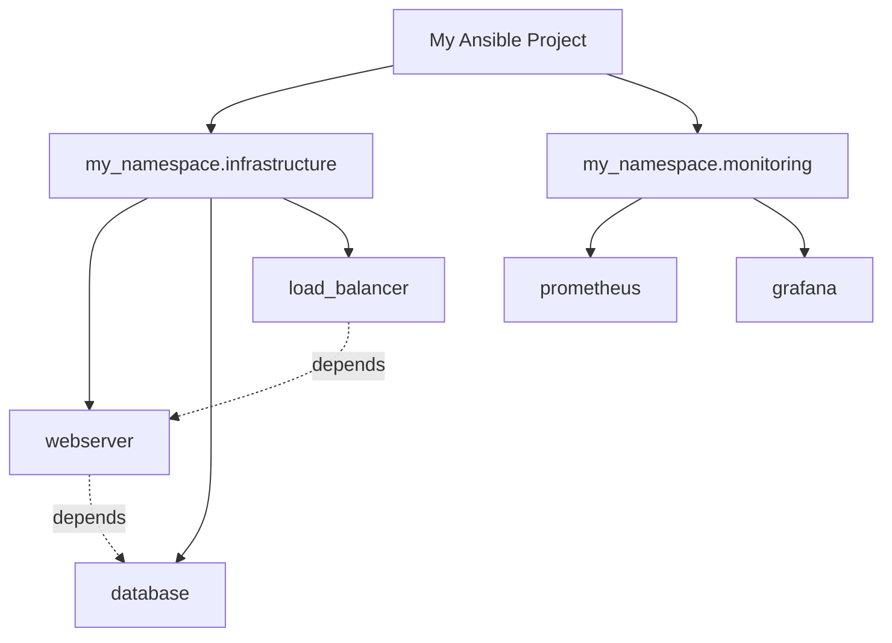

**Features**:

- Solid lines: parent-child relationships
- Dashed lines: dependencies
- Clickable nodes linking to documentation

---

## Example 2: Flowchart with Subgraphs

**Use Case**: Medium project with logical grouping

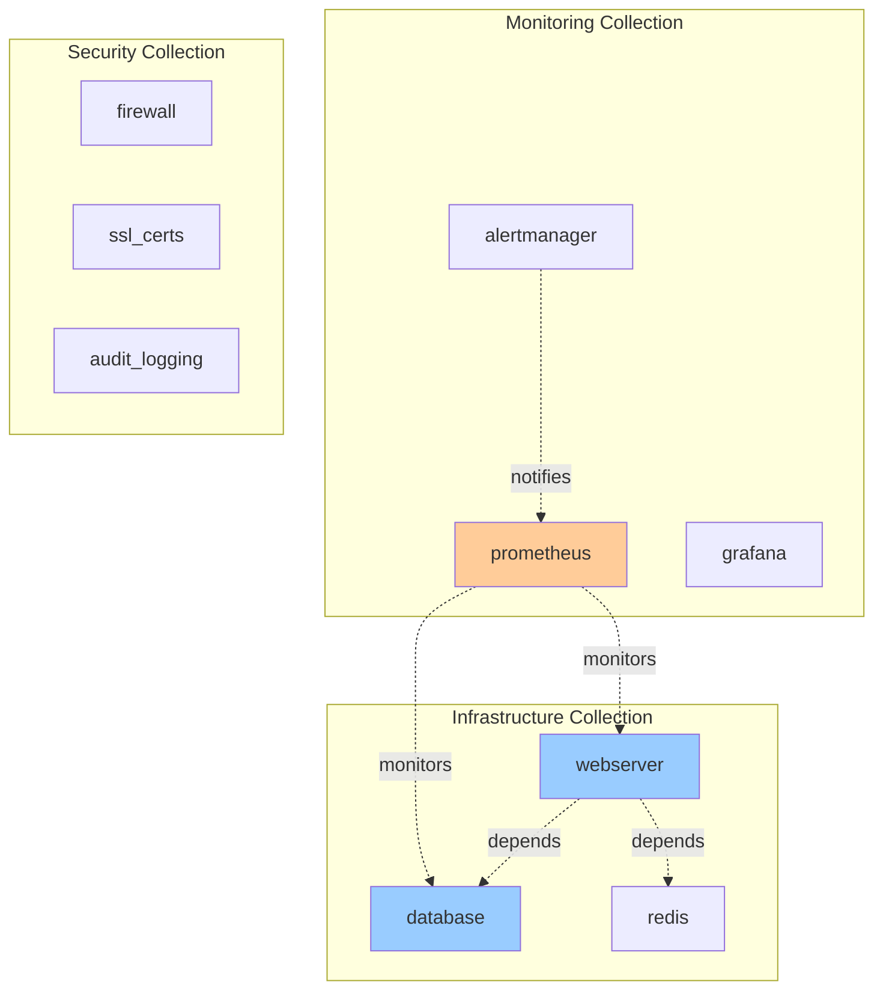

**Features**:

- Subgraphs for collections
- Custom styling by importance
- Multiple relationship types (depends, monitors, notifies)

---

## Example 3: Left-Right Layout

**Use Case**: Wide hierarchy, better use of horizontal space

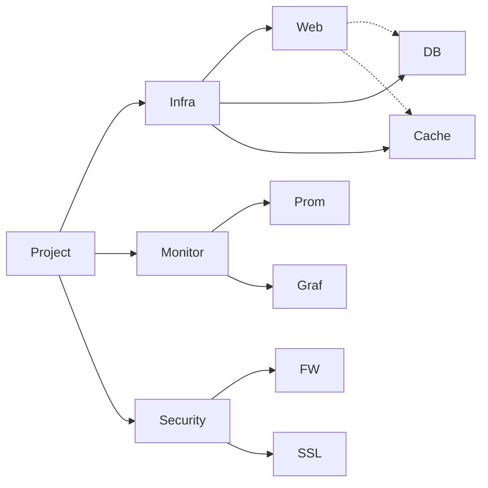

**Features**:

- Left-to-right layout (LR)
- More compact for wide structures

---

## Example 4: Mindmap Style

**Use Case**: Large project (50+ components), radial layout

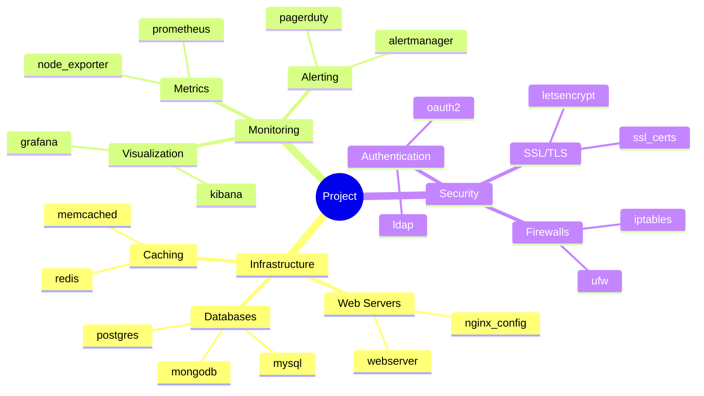

**Features**:

- Radial layout handles density better
- Hierarchical grouping by category
- No explicit links (implied by structure)

---

## Example 5: Dependency Graph

**Use Case**: Show complex dependencies between roles

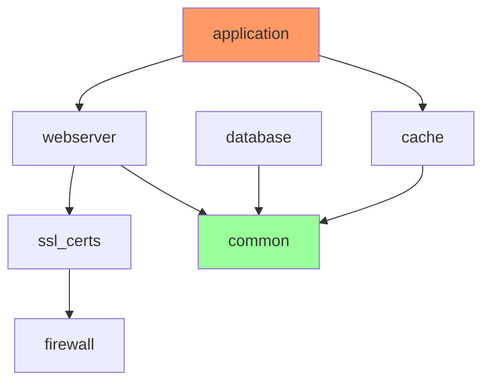

**Features**:

- Focus on dependencies, not hierarchy
- Color-coding: red=application, green=common/shared
- Shows which roles are foundational (common)

---

## Example 6: Collection with Plugins

**Use Case**: Show both roles and plugins in a collection

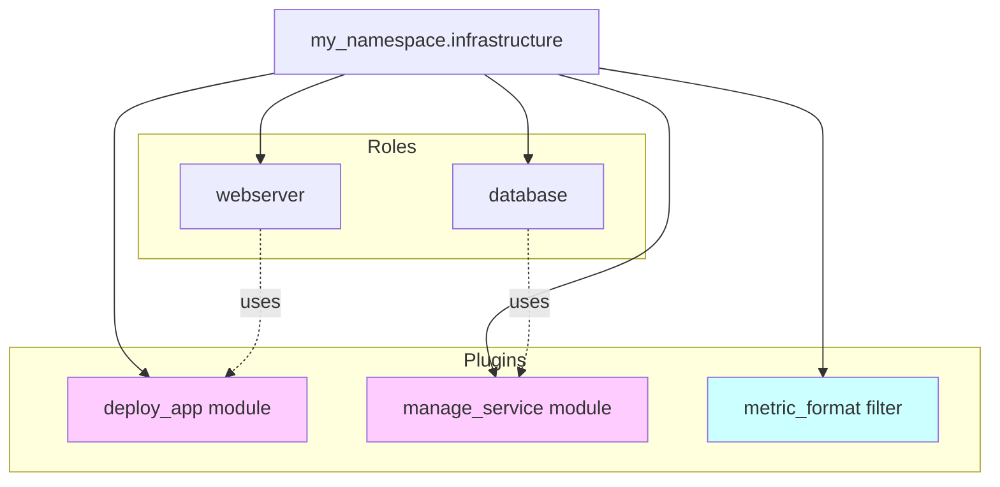

**Features**:

- Different node colors for plugins vs roles
- Shows plugin usage by roles
- Clear separation of concerns

---

## Example 7: Project with Playbooks

**Use Case**: Show playbooks and which roles they use

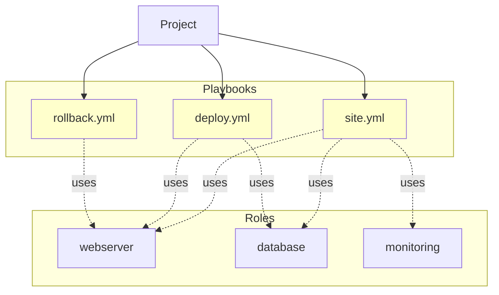

**Features**:

- Playbooks shown as distinct type
- "uses" relationships show role usage
- Yellow for playbooks, default for roles

---

## Example 8: Circular Dependency Warning

**Use Case**: Detect and visualize circular dependencies

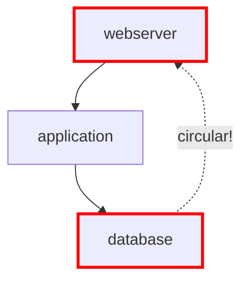

**Features**:

- Red border for roles in cycle
- Dashed line with "circular!" label
- Helps identify problematic dependencies

---

## Example 9: Large Project with Clustering

**Use Case**: 100+ components, need to reduce clutter

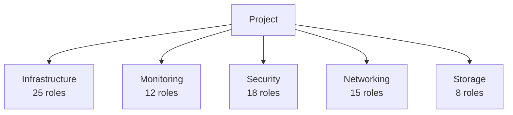

**Features**:

- Collapsed collections showing count
- Links to collection README (expanded view)
- Keeps diagram readable at project level

---

## Example 10: Status Indicators

**Use Case**: Show role maturity/status in diagram

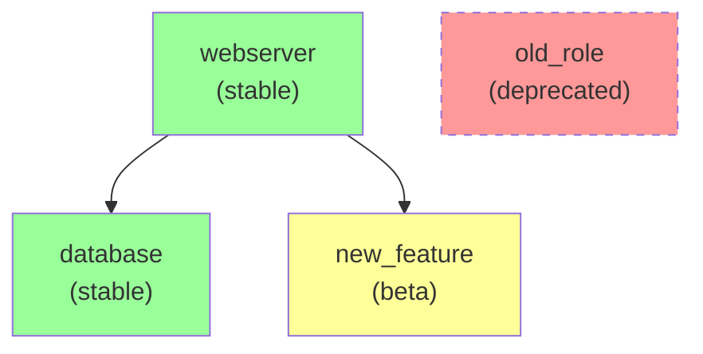

**Features**:

- Green: stable/production
- Yellow: beta/testing
- Red + dashed: deprecated
- Status in node label

---

## Template Integration

### In Jinja2 Template

```jinja2
## Project Structure

{{ index('collections', format='diagram', diagram_type='flowchart') }}
```

### Generated Output

```markdown
## Project Structure

\`\`\`mermaid
graph TD
    Project["My Ansible Project"]
    Coll1["infrastructure"]
    Coll2["monitoring"]
    
    Project --> Coll1
    Project --> Coll2
    
    click Coll1 "./infrastructure/README.md"
    click Coll2 "./monitoring/README.md"
\`\`\`
```

---

## Mermaid Syntax Reference

### Basic Graph Types

- `graph TD`: Top-down flowchart
- `graph LR`: Left-right flowchart
- `graph BT`: Bottom-top flowchart
- `graph RL`: Right-left flowchart
- `mindmap`: Radial mindmap

### Node Shapes

- `[Text]`: Rectangle
- `(Text)`: Rounded rectangle
- `([Text])`: Stadium (pill shape)
- `[[Text]]`: Subroutine
- `[(Text)]`: Cylindrical (database)
- `((Text))`: Circle
- `{Text}`: Diamond (decision)

### Line Types

- `-->`: Solid arrow
- `-.->`: Dashed arrow
- `==>`: Thick arrow
- `--Text-->`: Arrow with label
- `---`: No arrow

### Styling

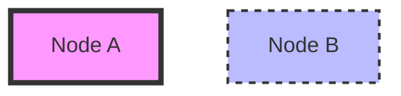

### Clickable Links

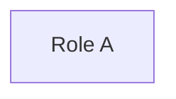

---

## Performance Considerations

| Node Count | Recommended Diagram Type | Rationale |
| ------------ | ------------------------- | ----------- |
| 1-20 | Flowchart (TD/LR) | Simple, easy to read |
| 21-50 | Flowchart with subgraphs | Organized by collection |
| 51-100 | Mindmap | Radial layout handles density |
| 100+ | Clustered flowchart | Show collections with counts, link to details |

**Browser Rendering**:

- Mermaid renders on client-side (JavaScript)
- Large diagrams (100+ nodes) may be slow
- Consider splitting into multiple diagrams per collection
