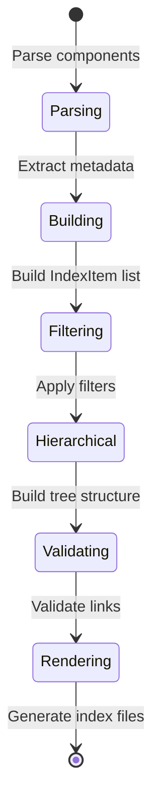
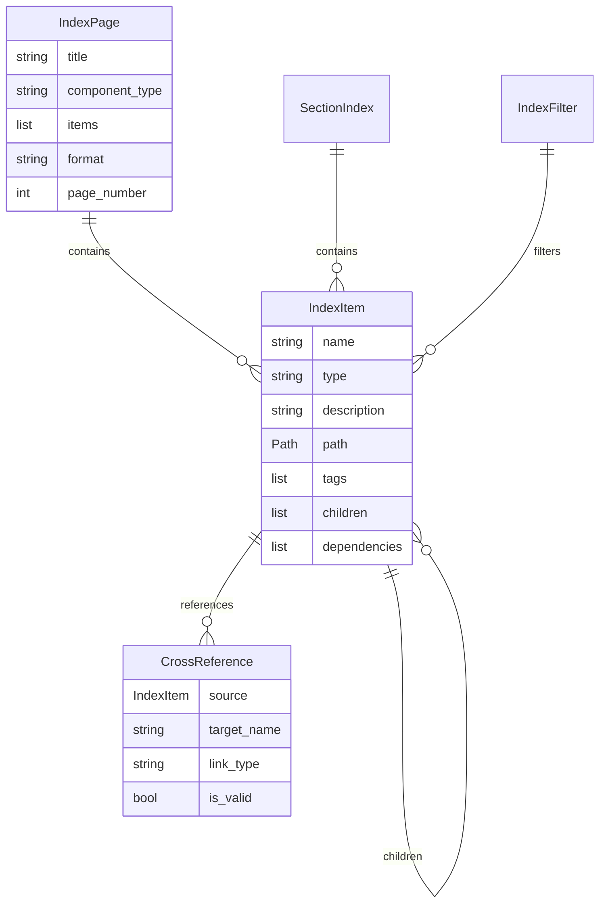

# Data Model: Indexes & Navigation

**Date**: 2025-12-03  
**Feature**: Spec 011 - Indexes & Navigation

## Overview

This document defines the data models for index generation, component hierarchies, cross-references, and filtering.

---

## Core Models

### IndexItem

**Purpose**: Single entry in an index representing a component with metadata.

**Schema**:
```python
from pydantic import BaseModel, Field
from pathlib import Path
from typing import Any, Literal

class IndexItem(BaseModel):
    \"\"\"Single component entry with metadata and navigation.\"\"\"
    
    name: str = Field(
        description="Component name (role name, collection name)"
    )
    type: Literal["collection", "role", "plugin", "module", "playbook"] = Field(
        description="Component type"
    )
    description: str | None = Field(
        default=None,
        description="Component description (may be None)"
    )
    path: Path = Field(
        description="Relative path to component from project root"
    )
    doc_link: str | None = Field(
        default=None,
        description="Relative link to generated documentation"
    )
    tags: list[str] = Field(
        default_factory=list,
        description="Tags for filtering and categorization"
    )
    namespace: str | None = Field(
        default=None,
        description="Collection namespace (for collections and roles)"
    )
    metadata: dict[str, Any] = Field(
        default_factory=dict,
        description="Custom metadata fields"
    )
    children: list["IndexItem"] = Field(
        default_factory=list,
        description="Child components (for hierarchical items)"
    )
    dependencies: list[str] = Field(
        default_factory=list,
        description="Names of components this depends on"
    )
    used_by: list[str] = Field(
        default_factory=list,
        description="Names of components that use this"
    )
    
    @property
    def depth(self) -> int:
        \"\"\"Calculate depth in hierarchy (root=0).\"\"\"
        if not self.children:
            return 0
        return 1 + max(child.depth for child in self.children)
    
    @property
    def total_descendants(self) -> int:
        \"\"\"Count all descendants recursively.\"\"\"
        if not self.children:
            return 0
        return len(self.children) + sum(
            child.total_descendants for child in self.children
        )
    
    def find_child(self, name: str) -> "IndexItem | None":
        \"\"\"Find direct child by name.\"\"\"
        for child in self.children:
            if child.name == name:
                return child
        return None
    
    def find_descendant(self, name: str) -> "IndexItem | None":
        \"\"\"Find descendant at any level by name.\"\"\"
        if self.name == name:
            return self
        for child in self.children:
            result = child.find_descendant(name)
            if result:
                return result
        return None
```

**Relationships**:
- Parent-child via `children` list (hierarchical structure)
- Dependencies via `dependencies` list (directed graph)
- Links to documentation via `doc_link` (cross-reference)

**Validation Rules**:
- `name`: Non-empty string
- `type`: Must be one of allowed types
- `path`: Must be relative path (no absolute paths)
- `doc_link`: Must be relative URL if provided
- `children`: No circular references (validated separately)

---

### IndexPage

**Purpose**: Standalone index page for a component type.

**Schema**:
```python
class IndexPage(BaseModel):
    \"\"\"Standalone index page listing components.\"\"\"
    
    title: str = Field(
        description="Page title (e.g., 'Role Index', 'Collection Index')"
    )
    component_type: str = Field(
        description="Type of components indexed (roles, collections, etc.)"
    )
    items: list[IndexItem] = Field(
        description="Components to display on this page"
    )
    format: Literal["list", "table", "tree", "nested-table", "diagram"] = Field(
        default="list",
        description="Visualization style"
    )
    total_count: int = Field(
        description="Total number of components (across all pages)"
    )
    filtered_count: int | None = Field(
        default=None,
        description="Number of components after filtering (if filter applied)"
    )
    page_number: int = Field(
        default=1,
        ge=1,
        description="Current page number (1-indexed)"
    )
    total_pages: int = Field(
        default=1,
        ge=1,
        description="Total number of pages"
    )
    filters_applied: list[str] = Field(
        default_factory=list,
        description="Human-readable filter descriptions"
    )
    
    @property
    def has_pagination(self) -> bool:
        \"\"\"Check if pagination is needed.\"\"\"
        return self.total_pages > 1
    
    @property
    def has_previous(self) -> bool:
        \"\"\"Check if previous page exists.\"\"\"
        return self.page_number > 1
    
    @property
    def has_next(self) -> bool:
        \"\"\"Check if next page exists.\"\"\"
        return self.page_number < self.total_pages
    
    @property
    def previous_page_link(self) -> str | None:
        \"\"\"Generate link to previous page.\"\"\"
        if not self.has_previous:
            return None
        if self.page_number == 2:
            return \"./index.md\"
        return f\"./index-{self.page_number - 1}.md\"
    
    @property
    def next_page_link(self) -> str | None:
        \"\"\"Generate link to next page.\"\"\"
        if not self.has_next:
            return None
        return f\"./index-{self.page_number + 1}.md\"
    
    def render(self, template_engine: Any) -> str:
        \"\"\"Render index page using appropriate template.\"\"\"
        template_name = f\"index/{self.format}.j2\"
        return template_engine.render(template_name, page=self)
```

**Validation Rules**:
- `page_number` <= `total_pages`
- `filtered_count` <= `total_count` if set
- `len(items)` <= `total_count`

---

### SectionIndex

**Purpose**: Embedded index section within parent documentation.

**Schema**:
```python
class SectionIndex(BaseModel):
    \"\"\"Embedded index section for template markers.\"\"\"
    
    component_type: str = Field(
        description="Type of components to index"
    )
    items: list[IndexItem] = Field(
        description="Components to display"
    )
    format: Literal["list", "table", "tree"] = Field(
        default="list",
        description="Visualization style (limited for inline use)"
    )
    limit: int | None = Field(
        default=None,
        ge=1,
        description="Maximum items to show (None = show all)"
    )
    show_more_link: bool = Field(
        default=True,
        description="Show 'View all' link to full index page"
    )
    more_link_text: str = Field(
        default="View all {type}",
        description="Text for 'more' link"
    )
    more_link_url: str | None = Field(
        default=None,
        description="URL for 'more' link (auto-generated if None)"
    )
    group_by: str | None = Field(
        default=None,
        description="Group items by field (type, tag, namespace)"
    )
    
    @property
    def display_items(self) -> list[IndexItem]:
        \"\"\"Get items to display (respecting limit).\"\"\"
        if self.limit is None:
            return self.items
        return self.items[:self.limit]
    
    @property
    def has_more(self) -> bool:
        \"\"\"Check if there are more items beyond limit.\"\"\"
        if self.limit is None:
            return False
        return len(self.items) > self.limit
    
    @property
    def more_count(self) -> int:
        \"\"\"Count of items beyond limit.\"\"\"
        if not self.has_more:
            return 0
        return len(self.items) - self.limit
    
    def render_inline(self, template_engine: Any) -> str:
        \"\"\"Render as inline section for embedding.\"\"\"
        template_name = f\"index/{self.format}_section.j2\"
        return template_engine.render(template_name, section=self)
```

---

### IndexFilter

**Purpose**: Criteria for filtering index content.

**Schema**:
```python
class IndexFilter(BaseModel):
    \"\"\"Filter criteria for index content.\"\"\"
    
    field: str = Field(
        description="Field to filter on (tag, namespace, type, status, etc.)"
    )
    operator: Literal["equals", "contains", "startswith", "in"] = Field(
        default="equals",
        description="Comparison operator"
    )
    value: str | list[str] = Field(
        description="Value(s) to match"
    )
    
    @classmethod
    def from_string(cls, filter_str: str) -> "IndexFilter":
        \"\"\"
        Parse filter from string format.
        
        Examples:
            'tag:database' -> IndexFilter(field='tag', operator='equals', value='database')
            'namespace:my_*' -> IndexFilter(field='namespace', operator='startswith', value='my_')
            'type:role,collection' -> IndexFilter(field='type', operator='in', value=['role', 'collection'])
        \"\"\"
        if ':' not in filter_str:
            raise ValueError(f\"Invalid filter format: {filter_str}. Expected 'field:value'\")
        
        field, value = filter_str.split(':', 1)
        
        # Detect operator from value
        if ',' in value:
            return cls(field=field, operator='in', value=value.split(','))
        elif value.endswith('*'):
            return cls(field=field, operator='startswith', value=value[:-1])
        elif '*' in value:
            return cls(field=field, operator='contains', value=value.replace('*', ''))
        else:
            return cls(field=field, operator='equals', value=value)
    
    def matches(self, item: IndexItem) -> bool:
        \"\"\"Check if item matches filter criteria.\"\"\"
        # Get field value from item
        if self.field == 'tag':
            item_value = item.tags
        elif self.field == 'namespace':
            item_value = item.namespace
        elif self.field == 'type':
            item_value = item.type
        else:
            item_value = item.metadata.get(self.field)
        
        # Handle None values
        if item_value is None:
            return False
        
        # Apply operator
        if self.operator == 'equals':
            if isinstance(item_value, list):
                return self.value in item_value
            return item_value == self.value
        
        elif self.operator == 'contains':
            if isinstance(item_value, list):
                return any(self.value in str(v) for v in item_value)
            return self.value in str(item_value)
        
        elif self.operator == 'startswith':
            if isinstance(item_value, list):
                return any(str(v).startswith(self.value) for v in item_value)
            return str(item_value).startswith(self.value)
        
        elif self.operator == 'in':
            if isinstance(item_value, list):
                return any(v in self.value for v in item_value)
            return item_value in self.value
        
        return False
```

---

### CrossReference

**Purpose**: Link between components with validation status.

**Schema**:
```python
class CrossReference(BaseModel):
    \"\"\"Cross-reference link between components.\"\"\"
    
    source: IndexItem = Field(
        description="Source component"
    )
    target_name: str = Field(
        description="Name of target component"
    )
    target_type: str = Field(
        description="Type of target component"
    )
    link_type: Literal["dependency", "used_by", "related", "parent", "child"] = Field(
        description="Type of relationship"
    )
    resolved_path: Path | None = Field(
        default=None,
        description="Resolved path to target documentation (set by validator)"
    )
    is_valid: bool = Field(
        default=False,
        description="Whether link has been validated and target exists"
    )
    validation_error: str | None = Field(
        default=None,
        description="Error message if validation failed"
    )
    
    @property
    def link_text(self) -> str:
        \"\"\"Generate Markdown link text.\"\"\"
        if self.is_valid and self.resolved_path:
            return f\"[{self.target_name}]({self.resolved_path})\"
        else:
            return f\"{self.target_name} (broken link)\"
    
    @property
    def relative_link(self) -> str:
        \"\"\"Generate relative link from source to target.\"\"\"
        if not self.resolved_path:
            return \"#\"
        # Calculate relative path from source.path to resolved_path
        return str(self.resolved_path.relative_to(self.source.path.parent))
```

---

## Protocols

### IndexGenerator

**Purpose**: Generate index pages and sections.

**Protocol**:
```python
from typing import Protocol

class IndexGenerator(Protocol):
    \"\"\"Protocol for index generation.\"\"\"
    
    def generate_index_page(
        self,
        component_type: str,
        items: list[IndexItem],
        format: str = \"list\",
        filters: list[IndexFilter] | None = None,
        page_size: int = 50,
    ) -> list[IndexPage]:
        \"\"\"
        Generate standalone index pages.
        
        Returns:
            List of IndexPage objects (one per page if paginated)
        \"\"\"
        ...
    
    def generate_section_index(
        self,
        component_type: str,
        items: list[IndexItem],
        format: str = \"list\",
        limit: int | None = None,
        group_by: str | None = None,
    ) -> SectionIndex:
        \"\"\"Generate embedded section index.\"\"\"
        ...
    
    def build_hierarchy(
        self,
        items: list[IndexItem],
        max_depth: int = 5,
    ) -> list[IndexItem]:
        \"\"\"Build hierarchical tree from flat item list.\"\"\"
        ...
    
    def apply_filters(
        self,
        items: list[IndexItem],
        filters: list[IndexFilter],
    ) -> list[IndexItem]:
        \"\"\"Filter items by criteria.\"\"\"
        ...
```

---

## Validation Rules

### IndexItem Validation

1. **No Circular Dependencies**:
   ```python
   def validate_no_cycles(root: IndexItem) -> bool:
       visited = set()
       stack = set()
       
       def dfs(item: IndexItem) -> bool:
           if item.name in stack:
               return False  # Cycle detected
           if item.name in visited:
               return True
           
           visited.add(item.name)
           stack.add(item.name)
           
           for child in item.children:
               if not dfs(child):
                   return False
           
           stack.remove(item.name)
           return True
       
       return dfs(root)
   ```

2. **Depth Limit**:
   - Max depth: 10 levels (configurable)
   - Warn if depth > 5 (consider flattening)

3. **Description Length**:
   - Recommend: 50-200 characters
   - Max: 500 characters
   - Truncate in list view if > 200

### Link Validation

1. **File Existence**:
   - Target file must exist in output directory
   - Log warning if missing

2. **Relative Paths**:
   - All links must be relative
   - No absolute paths or external URLs

---

## State Transitions



---

## Relationships



---

## Performance Characteristics

| Operation | Time Complexity | Space Complexity |
|-----------|----------------|------------------|
| Build flat index | O(n) | O(n) |
| Build hierarchy | O(n log n) | O(n) |
| Filter by tag | O(1) with index | O(k) where k = matches |
| Validate links | O(m) where m = links | O(m) |
| Render tree | O(n) | O(h) where h = max depth |
| Paginate | O(n) | O(n) |

**Memory Usage**:
- IndexItem: ~500 bytes per item
- 500 components: ~250KB
- With hierarchy: ~400KB (includes parent references)
- Acceptable for in-memory processing
