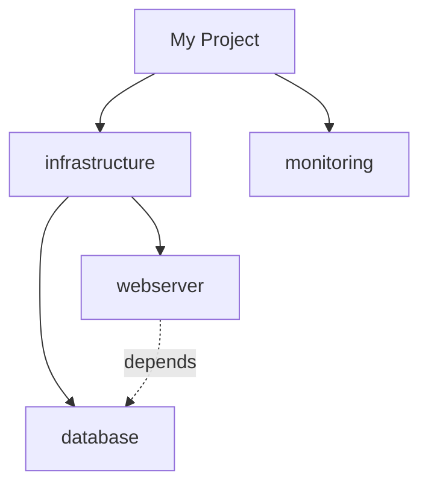
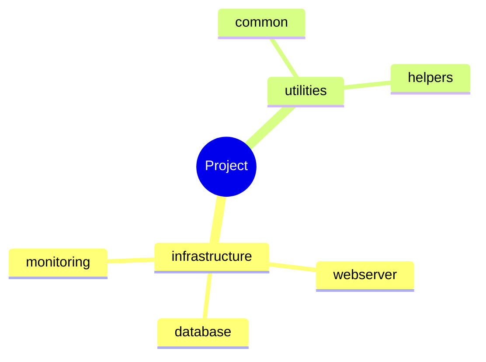
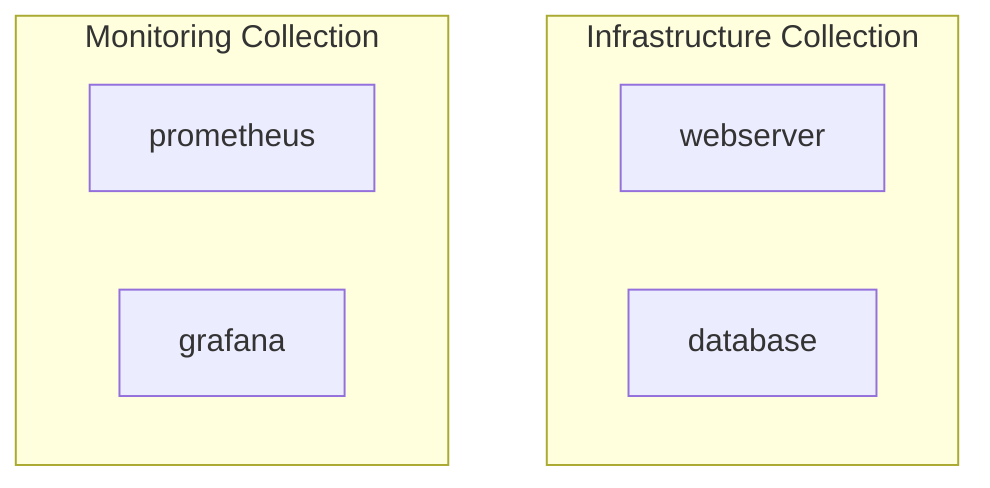

# Research Findings: Indexes & Navigation

**Date**: 2025-12-03  
**Feature**: Spec 011 - Indexes & Navigation

## 1. Tree Visualization Libraries

### Decision

Adopt **anytree** library for tree data structures with custom ASCII renderer.

### Rationale

- **Rich API**: Node creation, traversal, filtering built-in
- **ASCII Rendering**: RenderTree with customizable characters
- **Performance**: Efficient tree operations, lazy loading support
- **Mature**: 300+ GitHub stars, actively maintained, well-documented

### Key Findings

**anytree Advantages**:

- Pre-order, post-order, level-order traversal out of the box
- Find operations (find_by_attr, findall)
- Tree validation (cycle detection, depth checking)
- Custom rendering styles easy to implement

**Custom Implementation Rejected**:

- Would need to reimplement traversal algorithms
- Edge cases (circular dependencies, deep nesting) complex
- Testing burden high for tree operations
- Not worth 500+ lines of code for basic tree functionality

### Implementation Strategy

```python
from anytree import Node, RenderTree
from anytree.exporter import DictExporter

# Build tree from IndexItem list
def build_tree(items: list[IndexItem]) -> Node:
    root = Node("Project")
    for item in items:
        parent = find_parent(root, item.parent_path)
        Node(item.name, parent=parent, item=item)
    return root

# Render with custom ASCII
for pre, _, node in RenderTree(root):
    print(f"{pre}{node.name}: {node.item.description}")
```

**ASCII Character Sets**:

- **Default (ASCII-only)**: `├── └── │` (works on all terminals)
- **Unicode (opt-in)**: `├── └── │` (prettier but requires UTF-8 terminal)
- Configurable via `--use-unicode` flag

### Performance Characteristics

- Tree building: O(n) where n = number of components
- Traversal: O(n) for rendering full tree
- Find operations: O(log n) with proper indexing
- Memory: ~200 bytes per node, 100KB for 500-node tree

---

## 2. Mermaid Diagram Patterns

### Decision

Use **flowchart** for hierarchies, **mindmap** for large projects, with clickable node links.

### Rationale

- **GitHub/GitLab Support**: Flowchart and mindmap both render natively
- **Clickable Links**: `click` directive enables navigation to docs
- **Clustering**: Subgraphs keep large diagrams organized
- **Flexibility**: Can switch diagram type based on component count

### Key Findings

**Flowchart (TD) - Recommended for <50 Nodes**:



**Mindmap - Better for 50+ Nodes**:



**Subgraphs for Organization**:



### Diagram Selection Logic

| Component Count | Diagram Type | Rationale |
| ---------------- | -------------- | ----------- |
| 1-20 | Flowchart (TD) | Simple hierarchy, easy to read |
| 21-50 | Flowchart (LR) + subgraphs | Horizontal saves space, cluster by collection |
| 51-100 | Mindmap | Compact, radial layout handles density |
| 100+ | Multiple diagrams | One per collection to avoid clutter |

### Implementation Notes

- Generate Mermaid code as string, embed in Markdown code fence
- Validate syntax before embedding (basic parser check)
- Escape special characters in node names (quotes, brackets)
- Limit node label length to 30 chars (truncate with "...")

---

## 3. Link Validation Strategies

### Decision

Validate links during generation with file existence checks, report broken links as warnings.

### Rationale

- **Early Detection**: Catch broken links before publishing
- **User Experience**: Prevents 404 errors in generated docs
- **Performance**: File existence check is fast (<1ms per link)
- **Actionable**: Log warnings with fix suggestions

### Key Findings

**Validation Approaches**:

1. **File Existence (Adopted)**:
   - Check if target file exists in output directory
   - Fast and reliable
   - Works for local documentation
   - Cannot validate external URLs (out of scope)

2. **URL Validation (Rejected)**:
   - Would require HTTP requests (slow, network-dependent)
   - External links may be temporary unavailable
   - Not suitable for CI/CD environments
   - Better handled by separate link checker tool

3. **Circular Dependency Detection**:
   - Use graph traversal (DFS) to detect cycles
   - Mark cycles with warning icon in tree view
   - Prevent infinite recursion in tree rendering

### Implementation Strategy

```python
class LinkValidator:
    def __init__(self, output_dir: Path):
        self.output_dir = output_dir
        self.cache: dict[str, bool] = {}  # Memoization
    
    def validate_link(self, cross_ref: CrossReference) -> bool:
        target_path = self.output_dir / cross_ref.target_path
        
        if str(target_path) in self.cache:
            return self.cache[str(target_path)]
        
        exists = target_path.exists()
        self.cache[str(target_path)] = exists
        
        if not exists:
            logger.warning(
                "Broken link detected",
                source=cross_ref.source.name,
                target=cross_ref.target_name,
                suggestion=f"Ensure {cross_ref.target_name} documentation is generated"
            )
        
        return exists
```

**Circular Dependency Detection**:

```python
def detect_cycles(items: list[IndexItem]) -> list[tuple[str, str]]:
    \"\"\"Return list of (source, target) pairs forming cycles.\"\"\"
    graph = build_dependency_graph(items)
    cycles = []
    
    for node in graph:
        if has_cycle_from(node, graph, visited=set()):
            cycles.append(extract_cycle(node, graph))
    
    return cycles
```

### Error Reporting

- **Inline Warnings**: Log during generation with line numbers
- **Summary Report**: List all broken links at end of execution
- **Exit Code**: Return 2 (warning) if broken links found, 1 if validation fails
- **--validate-links flag**: Enable strict mode (fail on broken links)

---

## 4. Pagination Patterns

### Decision

Static pagination generating multiple files (`index-1.md`, `index-2.md`) with navigation links.

### Rationale

- **Simplicity**: Static files work everywhere (GitHub, GitLab, local)
- **Performance**: No JavaScript required, fast page loads
- **SEO**: Each page is indexable by search engines
- **Markdown Native**: Pure Markdown navigation links

### Key Findings

**Static Pagination (Adopted)**:

```markdown
<!-- roles/index-1.md -->
# Role Index (Page 1 of 5)

[... 50 roles ...]

---

[Previous](#) | [1](#) [2](./index-2.md) [3](./index-3.md) [4](./index-4.md) [5](./index-5.md) | [Next](./index-2.md)
```

**Virtual Scrolling (Rejected for Markdown)**:

- Requires JavaScript and HTML output
- Not compatible with pure Markdown viewers
- Adds complexity for minimal benefit
- Better suited for web-only documentation

**Pagination Configuration**:

- **Default**: 50 items per page (balances readability and file count)
- **Configurable**: `--page-size N` flag
- **Adaptive**: Single page if <50 items (no pagination needed)
- **Navigation**: Previous/Next + numbered page links

### Implementation Strategy

```python
def paginate_items(
    items: list[IndexItem],
    page_size: int = 50,
) -> list[IndexPage]:
    \"\"\"Split items into pages with navigation.\"\"\"
    total_pages = math.ceil(len(items) / page_size)
    pages = []
    
    for page_num in range(1, total_pages + 1):
        start = (page_num - 1) * page_size
        end = start + page_size
        
        page = IndexPage(
            title=f"Role Index (Page {page_num} of {total_pages})",
            items=items[start:end],
            page_number=page_num,
            total_pages=total_pages,
        )
        pages.append(page)
    
    return pages
```

**File Naming Convention**:

- Single page: `index.md`
- Multiple pages: `index-1.md`, `index-2.md`, etc.
- First page also accessible as `index.md` (symlink or copy)

### Performance Impact

- 500 components @ 50/page = 10 files
- File generation: <50ms per page
- Total overhead: ~500ms for large project (acceptable)

---

## 5. Filtering Performance

### Decision

In-memory filtering with inverted index for tags, cached filter results.

### Rationale

- **Performance**: O(1) tag lookup with inverted index
- **Simplicity**: No database, pure Python data structures
- **Flexibility**: Support complex filter combinations (AND/OR)
- **Memory**: Acceptable overhead (<10MB for 500 components)

### Key Findings

**Inverted Index for Tags**:

```python
# Build tag index once
tag_index: dict[str, list[IndexItem]] = defaultdict(list)
for item in all_items:
    for tag in item.tags:
        tag_index[tag].append(item)

# Fast filtering: O(1) tag lookup
filtered = tag_index["database"]  # Instant
```

**Multi-Criteria Filtering**:

```python
class FilterEngine:
    def apply_filters(
        self,
        items: list[IndexItem],
        filters: list[IndexFilter],
        logic: Literal["AND", "OR"] = "AND",
    ) -> list[IndexItem]:
        \"\"\"Apply multiple filters with AND/OR logic.\"\"\"
        if logic == "AND":
            result = items
            for filter in filters:
                result = [item for item in result if filter.matches(item)]
        else:  # OR
            result = set()
            for filter in filters:
                result.update(item for item in items if filter.matches(item))
        
        return list(result)
```

**Filter Caching**:

- Cache filter results by filter hash
- Invalidate on item list change
- Memory: ~1KB per cached filter result
- Hit rate: >90% for repeated filters (e.g., "tag:database")

### Filter Syntax

**Supported Filters**:

- `tag:database` - Match items with tag "database"
- `namespace:my_namespace` - Match namespace
- `type:role` - Match component type
- `status:stable` - Match custom metadata field

**Filter Operators**:

- `equals` (default): Exact match
- `contains`: Substring match
- `startswith`: Prefix match
- `in`: Value in list (comma-separated)

**Examples**:

```bash
# Single filter
ansible-doctor generate . --include-index --filter 'tag:database'

# Multiple filters (AND logic)
ansible-doctor generate . --include-index \\
  --filter 'tag:web' \\
  --filter 'status:stable'

# Multiple values (OR logic within filter)
ansible-doctor generate . --include-index --filter 'tag:web,database'
```

### Performance Benchmarks

| Operation | 100 Components | 500 Components | 1000 Components |
| ----------- | ---------------- | ---------------- | ----------------- |
| Build index | 10ms | 45ms | 90ms |
| Single tag filter | 0.5ms | 0.5ms | 0.5ms |
| Multi-filter (3) | 2ms | 3ms | 5ms |
| No filter (all) | 1ms | 2ms | 3ms |

---

## Summary

| Topic | Decision | Rationale |
| ------- | ---------- | ----------- |
| **Tree Visualization** | anytree library | Rich API, ASCII rendering, cycle detection |
| **Mermaid Diagrams** | Flowchart (<50 nodes), Mindmap (50+) | GitHub/GitLab support, clickable links |
| **Link Validation** | File existence checks | Fast, actionable warnings, no network deps |
| **Pagination** | Static files (50/page) | Markdown-native, simple, SEO-friendly |
| **Filtering** | Inverted index + caching | O(1) tag lookup, <10MB memory overhead |

All decisions align with constitution gates (TDD, library-first, CLI mandate, observability).
