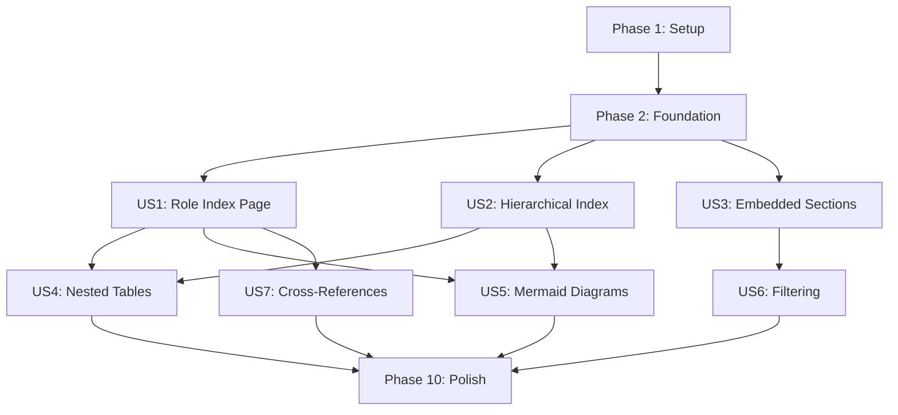

# Implementation Tasks: Indexes & Navigation

**Feature**: Spec 011 - Indexes & Navigation  
**Branch**: `011-indexes-navigation`  
**Generated**: 2025-12-03  
**Total Tasks**: 82  
**Estimated Effort**: 68 hours (~8.5 developer days)

---

## Phase 1: Setup (4 tasks, ~3 hours)

**Goal**: Initialize module structure, models, and test infrastructure.

- [ ] T001 Create index models module at ansibledoctor/models/index.py with IndexItem, IndexPage, SectionIndex models
- [ ] T002 [P] Create cross-reference models module at ansibledoctor/models/cross_reference.py with CrossReference model
- [ ] T003 [P] Create index generator module skeleton at ansibledoctor/generator/indexes.py with IndexGenerator protocol
- [ ] T004 [P] Create test fixtures directory at tests/fixtures/project_structures/ with simple_project/, hierarchical_project/, large_project/ subdirectories

---

## Phase 2: Foundational Tasks (7 tasks, ~5 hours) ⚠️ BLOCKING

**Goal**: Core index infrastructure that all user stories depend on.

**Note**: These tasks MUST complete before any user story work begins.

- [ ] T005 Write tests for IndexItem model in tests/unit/test_index_models.py (depth calculation, find_child, find_descendant)
- [ ] T006 Implement IndexItem model in ansibledoctor/models/index.py with properties (depth, total_descendants, find_child, find_descendant)
- [ ] T007 [P] Write tests for IndexPage model in tests/unit/test_index_models.py (pagination logic, filter tracking)
- [ ] T008 [P] Implement IndexPage model in ansibledoctor/models/index.py with render() method
- [ ] T009 [P] Write tests for SectionIndex model in tests/unit/test_index_models.py (inline rendering, limit behavior)
- [ ] T010 [P] Implement SectionIndex model in ansibledoctor/models/index.py with render_inline() method
- [ ] T011 Create test fixture projects in tests/fixtures/project_structures/ (simple: 1 collection/3 roles, hierarchical: 3 collections/15 roles, large: 500+ components)

---

## Phase 3: User Story 1 - Generate Role Index Page (15 tasks, ~12 hours, P1 MVP) 🎯

**Story Goal**: Generate dedicated role index pages with descriptions, tags, and links.

**Independent Test**: Run `ansible-doctor generate collection/ --include-index` → Creates `roles/index.md` with all roles listed.

### Tests First

- [ ] T012 [P] [US1] Write test for basic role index generation in tests/integration/test_index_generation.py (5 roles → roles/index.md created)
- [ ] T013 [P] [US1] Write test for role index with tags in tests/integration/test_index_generation.py (tags displayed correctly)
- [ ] T014 [P] [US1] Write test for role index with dependencies in tests/integration/test_index_generation.py (dependency links rendered)
- [ ] T015 [P] [US1] Write test for empty role collection in tests/integration/test_index_generation.py (empty message shown)
- [ ] T016 [P] [US1] Write test for multiple index formats in tests/integration/test_index_generation.py (list, table, tree formats)

### Implementation

- [ ] T017 [US1] Implement IndexGenerator.generate_index_page() in ansibledoctor/generator/indexes.py (basic page generation)
- [ ] T018 [P] [US1] Create list format template at ansibledoctor/templates/index/list.j2 (role list with links)
- [ ] T019 [P] [US1] Create table format template at ansibledoctor/templates/index/table.j2 (table with Name|Description|Tags|Dependencies columns)
- [ ] T020 [US1] Implement component metadata extraction in IndexGenerator (extract name, description, tags from parsed roles)
- [ ] T021 [US1] Implement dependency link generation in IndexGenerator (resolve dependency names to doc links)
- [ ] T022 [US1] Add CLI flags to ansibledoctor/cli/__init__.py (--include-index, --index-style, --index-format)
- [ ] T023 [US1] Integrate index generation into main generation flow in ansibledoctor/generator/engine.py (call after main docs)
- [ ] T024 [US1] Implement empty collection handling in IndexGenerator (detect empty, show message)
- [ ] T025 [US1] Write index files to output directory in IndexGenerator (docs/lang/{code}/roles/index.md)
- [ ] T026 [US1] Add index generation logging in IndexGenerator (component counts, duration)

---

## Phase 4: User Story 2 - Hierarchical Project Index (14 tasks, ~11 hours, P1 MVP) 🎯

**Story Goal**: Generate tree-style indexes showing project → collections → roles hierarchy.

**Independent Test**: Run `ansible-doctor generate project/ --index-style tree` → Creates index with tree visualization.

### Tests First

- [ ] T027 [P] [US2] Write test for project hierarchy in tests/integration/test_index_generation.py (2 collections, 3 roles each)
- [ ] T028 [P] [US2] Write test for plugin indexing in tests/integration/test_index_generation.py (plugins shown under collection)
- [ ] T029 [P] [US2] Write test for depth limiting in tests/integration/test_index_generation.py (--index-depth 2 limits tree)
- [ ] T030 [P] [US2] Write test for playbook indexing in tests/integration/test_index_generation.py (playbooks section)
- [ ] T031 [P] [US2] Write test for ASCII tree rendering in tests/unit/test_tree_visualizer.py (correct characters used)

### Implementation

- [ ] T032 [US2] Create TreeVisualizer class in ansibledoctor/generator/tree_visualizer.py with render_tree() method
- [ ] T033 [US2] Implement ASCII tree rendering in TreeVisualizer (├── └── │ characters)
- [ ] T034 [P] [US2] Add Unicode tree support in TreeVisualizer (use_unicode flag for box-drawing characters)
- [ ] T035 [US2] Implement IndexGenerator.build_hierarchy() in ansibledoctor/generator/indexes.py (convert flat list to tree)
- [ ] T036 [US2] Create tree format template at ansibledoctor/templates/index/tree.j2 (use TreeVisualizer output)
- [ ] T037 [US2] Implement plugin indexing in IndexGenerator (extract modules, filters, lookups, etc.)
- [ ] T038 [US2] Implement playbook indexing in IndexGenerator (parse playbook descriptions)
- [ ] T039 [US2] Add depth limiting logic in TreeVisualizer (max_depth parameter)
- [ ] T040 [US2] Add --index-depth CLI flag in ansibledoctor/cli/__init__.py (default 5)

---

## Phase 5: User Story 3 - Embed Section Index (12 tasks, ~9 hours, P1 MVP) 🎯

**Story Goal**: Support embedded index sections in documentation via template markers.

**Independent Test**: Generate collection docs → README includes "## Roles" section with role list.

### Tests First

- [ ] T041 [P] [US3] Write test for template marker parsing in tests/unit/test_index_generator.py ({{ index('roles') }} parsed)
- [ ] T042 [P] [US3] Write test for embedded table format in tests/integration/test_embedded_indexes.py (format='table' works)
- [ ] T043 [P] [US3] Write test for group_by in tests/integration/test_embedded_indexes.py (plugins grouped by type)
- [ ] T044 [P] [US3] Write test for limit parameter in tests/integration/test_embedded_indexes.py (limit=5 shows 5 + more link)
- [ ] T045 [P] [US3] Write test for filter parameter in tests/integration/test_embedded_indexes.py (filter='tag:database' works)

### Implementation

- [ ] T046 [US3] Implement IndexGenerator.generate_section_index() in ansibledoctor/generator/indexes.py (section index generation)
- [ ] T047 [US3] Register index() function as Jinja2 global in ansibledoctor/generator/engine.py (callable from templates)
- [ ] T048 [US3] Implement template marker argument parsing in index() function (parse format, limit, filter, group_by)
- [ ] T049 [US3] Implement limit logic in SectionIndex (show N items + "and X more..." link)
- [ ] T050 [US3] Implement group_by logic in SectionIndex (group plugins by type)
- [ ] T051 [US3] Add filter parameter support in index() function (parse filter string, apply criteria)
- [ ] T052 [US3] Create example templates using markers in demo/ (collection README with {{ index('roles') }})

---

## Phase 6: User Story 4 - Nested Tables (10 tasks, ~8 hours, P2)

**Story Goal**: Generate nested table format showing collections with inline children.

**Independent Test**: Generate project index with `--index-style nested-table` → Table shows collections with role/plugin summaries.

### Tests First

- [ ] T053 [P] [US4] Write test for nested table in tests/integration/test_index_generation.py (collections with child counts)
- [ ] T054 [P] [US4] Write test for nested depth in tests/unit/test_index_generator.py (--nested-depth 2 limits)
- [ ] T055 [P] [US4] Write test for HTML nested table in tests/integration/test_index_generation.py (expandable rows)
- [ ] T056 [P] [US4] Write test for Markdown nested table in tests/integration/test_index_generation.py (inline children)

### Implementation

- [ ] T057 [US4] Create nested_table.j2 template at ansibledoctor/templates/index/nested_table.j2 (collection|roles|plugins columns)
- [ ] T058 [US4] Implement nested table logic in IndexGenerator (calculate child summaries)
- [ ] T059 [US4] Add nested-depth parameter to IndexPage model (limit nesting levels)
- [ ] T060 [P] [US4] Implement HTML expandable rows in nested_table.j2 (JavaScript for expand/collapse)
- [ ] T061 [P] [US4] Implement Markdown static nested table in nested_table.j2 (comma-separated children)
- [ ] T062 [US4] Add --nested-depth CLI flag in ansibledoctor/cli/__init__.py (default 2)

---

## Phase 7: User Story 5 - Mermaid Diagrams (11 tasks, ~9 hours, P2)

**Story Goal**: Generate Mermaid diagrams showing project structure visually.

**Independent Test**: Generate project docs with `--index-style diagram` → Mermaid graph with clickable nodes.

### Tests First

- [ ] T063 [P] [US5] Write test for Mermaid flowchart in tests/unit/test_mermaid_builder.py (correct syntax generated)
- [ ] T064 [P] [US5] Write test for dependency arrows in tests/unit/test_mermaid_builder.py (dependencies shown)
- [ ] T065 [P] [US5] Write test for mindmap diagram in tests/unit/test_mermaid_builder.py (mindmap syntax)
- [ ] T066 [P] [US5] Write test for clickable nodes in tests/unit/test_mermaid_builder.py (click links included)
- [ ] T067 [P] [US5] Write test for large project clustering in tests/integration/test_index_generation.py (100+ components clustered)

### Implementation

- [ ] T068 [US5] Create MermaidBuilder class in ansibledoctor/utils/mermaid_builder.py with build_flowchart() method
- [ ] T069 [US5] Implement Mermaid flowchart generation in MermaidBuilder (graph TD syntax)
- [ ] T070 [US5] Implement dependency arrow rendering in MermaidBuilder (role1 -.depends.-> role2)
- [ ] T071 [P] [US5] Implement mindmap diagram in MermaidBuilder.build_mindmap() (mindmap syntax)
- [ ] T072 [US5] Add clickable node support in MermaidBuilder (click directive with doc links)
- [ ] T073 [US5] Create diagram.j2 template at ansibledoctor/templates/index/diagram.j2 (wrap Mermaid code)

---

## Phase 8: User Story 6 - Filter and Search (11 tasks, ~9 hours, P2)

**Story Goal**: Support filtering indexes by tag, namespace, type, and custom metadata.

**Independent Test**: Generate index with `--filter 'tag:web'` → Only matching components included.

### Tests First

- [ ] T074 [P] [US6] Write test for tag filtering in tests/unit/test_index_filters.py (tag:database filter)
- [ ] T075 [P] [US6] Write test for namespace filtering in tests/unit/test_index_filters.py (namespace:my_namespace filter)
- [ ] T076 [P] [US6] Write test for multiple filters in tests/unit/test_index_filters.py (AND logic)
- [ ] T077 [P] [US6] Write test for empty filter results in tests/integration/test_index_generation.py (no matches message)
- [ ] T078 [P] [US6] Write test for HTML client-side filtering in tests/integration/test_index_generation.py (filter box rendered)

### Implementation

- [ ] T079 [US6] Create IndexFilter model in ansibledoctor/models/index.py (field, operator, value, matches())
- [ ] T080 [US6] Implement filter parsing in CLI in ansibledoctor/cli/__init__.py (parse 'field:value' strings)
- [ ] T081 [US6] Implement filter application in IndexGenerator (apply filters before rendering)
- [ ] T082 [US6] Add --filter CLI flag in ansibledoctor/cli/__init__.py (multiple=True)
- [ ] T083 [US6] Implement empty filter message in templates (show when filtered_count=0)

---

## Phase 9: User Story 7 - Cross-Reference Links (12 tasks, ~11 hours, P3)

**Story Goal**: Add cross-reference links between related components with validation.

**Independent Test**: Generate role index → Each role links to docs, dependencies link correctly, broken links validated.

### Tests First

- [ ] T084 [P] [US7] Write test for cross-reference link generation in tests/unit/test_index_generator.py (role → doc link)
- [ ] T085 [P] [US7] Write test for dependency links in tests/unit/test_index_generator.py (dependency → doc link)
- [ ] T086 [P] [US7] Write test for broken link detection in tests/unit/test_link_validator.py (missing target detected)
- [ ] T087 [P] [US7] Write test for link validation in tests/integration/test_index_generation.py (--validate-links flag)
- [ ] T088 [P] [US7] Write test for used_by links in tests/unit/test_index_generator.py (reverse dependencies)

### Implementation

- [ ] T089 [US7] Create LinkValidator class in ansibledoctor/utils/link_validator.py with validate_link() method
- [ ] T090 [US7] Implement CrossReference model in ansibledoctor/models/cross_reference.py (source, target, link_type, is_valid)
- [ ] T091 [US7] Implement cross-reference link generation in IndexGenerator (resolve target paths)
- [ ] T092 [US7] Implement link validation in LinkValidator (check file existence)
- [ ] T093 [US7] Add broken link handling in templates (render as plain text, show warning icon)
- [ ] T094 [US7] Add --validate-links CLI flag in ansibledoctor/cli/__init__.py (enable validation)
- [ ] T095 [US7] Integrate link validation into generation flow (validate after index creation, report errors)

---

## Phase 10: Polish & Cross-Cutting Concerns (10 tasks, ~8 hours)

**Goal**: Documentation, optimization, integration testing, and release preparation.

- [ ] T096 [P] Update CHANGELOG.md with Spec 011 feature summary (index pages, embedded sections, multiple formats)
- [ ] T097 [P] Create user guide docs/INDEX_GUIDE.md (usage examples for all index styles)
- [ ] T098 [P] Update README.md with index feature showcase (examples of list, tree, nested-table, diagram)
- [ ] T099 [P] Add quickstart examples to docs/ (basic role index, hierarchical project, embedded sections)
- [ ] T100 Write comprehensive integration test in tests/integration/test_full_index_workflow.py (end-to-end with all features)
- [ ] T101 Performance test large project in tests/integration/test_index_performance.py (500+ components < 500ms)
- [ ] T102 [P] Add index generation metrics to execution reports (integrate with Spec 009 ExecutionReport)
- [ ] T103 Create demo projects in demo/ showing index features (collection with indexes, project with tree)
- [ ] T104 Update cli help text in ansibledoctor/cli/__init__.py (document all index flags with examples)
- [ ] T105 Final code review and cleanup (remove debug logging, optimize imports, fix style)

---

## Dependencies & Execution Strategy

### User Story Completion Order

### Parallel Execution Opportunities

**After Foundation Phase (T011 complete)**:

- **Group A** (Independent): T012-T016 (US1 tests), T027-T031 (US2 tests), T041-T045 (US3 tests)
- **Group B** (After US1 implementation): T018-T019 (templates), T053-T056 (US4 tests), T063-T067 (US5 tests)
- **Group C** (After US3 implementation): T074-T078 (US6 tests), T084-T088 (US7 tests)
- **Group D** (Documentation): T096-T099 (docs updates can happen in parallel with late-stage implementation)

### MVP Scope (US1 + US2 + US3)

**Tasks**: T001-T052 (52 tasks)  
**Effort**: ~32 hours (~4 developer days)  
**Deliverable**: Basic index generation with role indexes, hierarchical views, and embedded sections

**Why these stories**: Role indexes (US1) enable discovery, hierarchical views (US2) show structure, embedded sections (US3) improve UX. These three provide complete core indexing functionality. US4-US7 add advanced features but aren't blocking.

---

## Implementation Strategy

### TDD Workflow

1. **Test First**: Write tests for models/generators before implementation (T005-T010 for foundation, T012-T016 for US1, etc.)
2. **Implement**: Build features to pass tests
3. **Integrate**: Wire into CLI and generation engine
4. **Validate**: Run integration tests

### Incremental Delivery

1. **Sprint 1** (Setup + Foundation): T001-T011 (~8 hours) - Models, fixtures, basic infrastructure
2. **Sprint 2** (US1 MVP): T012-T026 (~12 hours) - Role index pages working
3. **Sprint 3** (US2 + US3 MVP): T027-T052 (~20 hours) - Hierarchical and embedded indexes
4. **Sprint 4** (US4 + US5): T053-T073 (~17 hours) - Advanced visualizations
5. **Sprint 5** (US6 + US7): T074-T095 (~20 hours) - Filtering and cross-references
6. **Sprint 6** (Polish): T096-T105 (~8 hours) - Documentation and optimization

### Testing Strategy

- **Unit Tests**: Models (IndexItem, IndexPage), TreeVisualizer, MermaidBuilder, IndexFilter, LinkValidator
- **Integration Tests**: Full index generation workflows, template marker integration, CLI flag combinations
- **Performance Tests**: 500+ component projects, pagination, large tree rendering
- **Fixture-Based**: Reusable test projects (simple/hierarchical/large) for consistent testing

---

## Success Metrics

- ✅ All 15 functional requirements (FR-001 to FR-015) implemented and tested
- ✅ All 7 user stories deliver expected behavior with acceptance criteria met
- ✅ Index generation <200ms per 100 components (SC-001)
- ✅ Tree visualizations support 5+ hierarchy levels (SC-004)
- ✅ 95%+ cross-reference links resolve correctly (SC-005)
- ✅ Mermaid diagrams render in GitHub/GitLab (SC-006)
- ✅ HTML indexes support client-side filtering (SC-007)
- ✅ Test coverage >85% for new code
- ✅ All edge cases handled (circular dependencies, missing descriptions, 500+ components)
- ✅ Constitution compliance verified (TDD, Library-First, CLI Mandate, Observability, Backward Compatibility)

---

## Notes

- **anytree library**: Add to dependencies for tree data structures (Phase 2, T032)
- **ASCII vs Unicode**: Default to ASCII (├── └── │), --use-unicode flag enables Unicode box-drawing
- **Pagination**: Default 50 items/page, configurable via --page-size flag
- **Circular Dependencies**: Detect during build_hierarchy(), log warning, prevent infinite recursion
- **Empty Descriptions**: Show "[No description]" placeholder, log warning for missing metadata
- **Language Support**: Generate language-specific indexes, link to same-language docs
- **Performance**: Target <200ms/100 components for index generation, <500ms for 500+ component projects
- **Mermaid Compatibility**: Test with GitHub/GitLab Markdown renderers, use standard Mermaid syntax
- **Template Marker Validation**: Validate syntax, show helpful error messages with line numbers
- **Link Validation**: Optional via --validate-links flag, warns on broken links, doesn't fail generation
