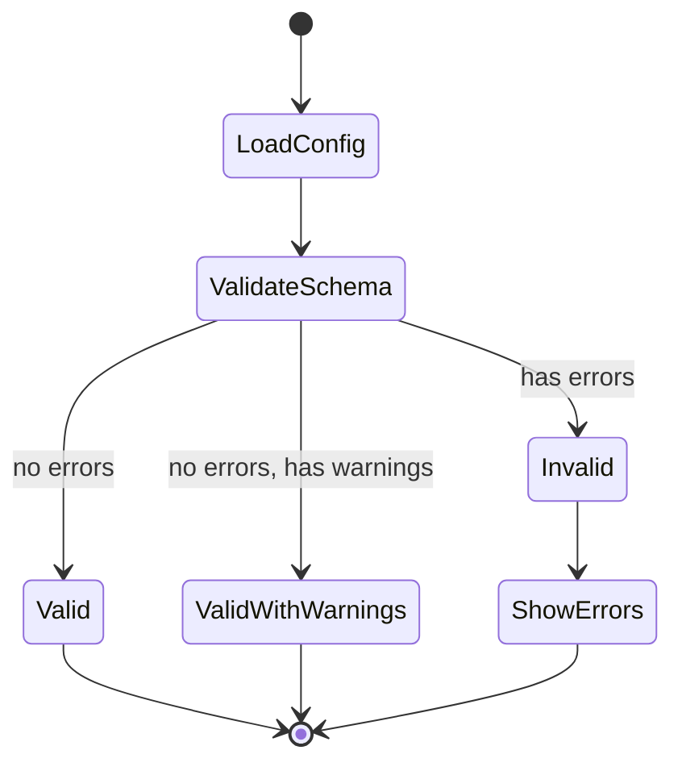
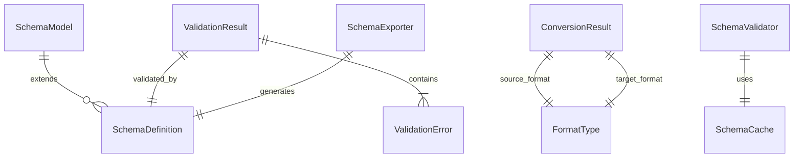

# Data Models: Schema Documentation & Validation

**Date**: 2025-12-03  
**Feature**: Spec 012 - Schema Documentation & Validation

This document defines data models, validation rules, and protocols for schema validation, format conversion, and documentation generation.

---

## Core Data Models

### 1. SchemaModel (Base Class)

Base class for all schema-related data structures with common JSON Schema metadata.

```python
from pydantic import BaseModel, Field, ConfigDict
from typing import Any

class SchemaModel(BaseModel):
    """Base model for all schema-related data structures."""
    
    schema_version: str = "draft-2020-12"  # JSON Schema version
    id: str | None = Field(default=None, alias="$id")  # Schema URI
    schema_uri: str | None = Field(default=None, alias="$schema")
    
    model_config = ConfigDict(
        populate_by_name=True,  # Allow both 'id' and '$id'
        extra='forbid',  # Strict validation
    )
```

**Fields**:
- `schema_version`: JSON Schema draft version (default: draft-2020-12)
- `id`: Schema identifier URI (e.g., "https://ansibledoctor.com/schemas/config.json")
- `schema_uri`: Reference to JSON Schema specification

**Usage**:
```python
class MySchema(SchemaModel):
    title: str
    properties: dict[str, Any]
```

---

### 2. ValidationError

Represents a single validation error with location, context, and recovery suggestions.

```python
from datetime import datetime
from typing import Any, Literal

class ValidationError(BaseModel):
    """Single validation error with location and context."""
    
    path: str  # JSONPath to error location (e.g., "$.languages.default")
    message: str  # Human-readable error message
    schema_path: str  # Schema path that failed (e.g., "#/properties/languages")
    validator: str  # Validator type (e.g., "enum", "type", "required")
    expected: Any | None  # Expected value/type
    actual: Any | None  # Actual value from config
    suggestion: str | None  # Recovery suggestion
    line_number: int | None = None  # Line number in source file (if available)
    
    @property
    def formatted_message(self) -> str:
        """Format error with line number and context."""
        prefix = f"Line {self.line_number}: " if self.line_number else ""
        return f"{prefix}{self.path}: {self.message}"
    
    @property
    def severity(self) -> Literal["error", "warning"]:
        """Determine severity based on validator type."""
        # Warnings: unknown properties, deprecated features
        # Errors: type mismatches, missing required fields
        warning_validators = {"additionalProperties", "deprecated"}
        return "warning" if self.validator in warning_validators else "error"
```

**Fields**:
- `path`: JSONPath to error location (e.g., `$.output_format`)
- `message`: Human-readable error description
- `schema_path`: Path in schema that failed (e.g., `#/properties/output_format/enum`)
- `validator`: JSON Schema validator keyword (enum, type, required, pattern, etc.)
- `expected`: Expected value or type
- `actual`: Actual value that failed validation
- `suggestion`: Actionable recovery suggestion
- `line_number`: Source file line number (from YAML parser)

**Example**:
```python
error = ValidationError(
    path="$.output_format",
    message="must be one of: markdown, html, rst",
    schema_path="#/properties/output_format/enum",
    validator="enum",
    expected=["markdown", "html", "rst"],
    actual="pdf",
    suggestion="Use --output-format markdown or edit .ansibledoctor.yml",
    line_number=5,
)

print(error.formatted_message)
# Output: "Line 5: $.output_format: must be one of: markdown, html, rst"
```

---

### 3. ValidationResult

Result of schema validation with errors, warnings, and metadata.

```python
class ValidationResult(BaseModel):
    """Result of schema validation with errors and warnings."""
    
    is_valid: bool
    errors: list[ValidationError] = Field(default_factory=list)
    warnings: list[ValidationError] = Field(default_factory=list)
    schema_id: str  # Schema used for validation
    validated_at: datetime = Field(default_factory=datetime.now)
    file_path: str | None = None  # Source file path
    duration_ms: float = 0.0  # Validation duration
    
    @property
    def error_count(self) -> int:
        """Total error count."""
        return len(self.errors)
    
    @property
    def warning_count(self) -> int:
        """Total warning count."""
        return len(self.warnings)
    
    def raise_if_invalid(self) -> None:
        """Raise exception if validation failed."""
        if not self.is_valid:
            error_summary = "\n".join(e.formatted_message for e in self.errors)
            raise ValueError(f"Validation failed:\n{error_summary}")
    
    def format_report(self, include_warnings: bool = True) -> str:
        """Generate human-readable validation report."""
        lines = []
        
        if self.is_valid:
            lines.append("✅ Validation passed")
        else:
            lines.append(f"❌ Validation failed with {self.error_count} error(s)")
        
        if self.errors:
            lines.append("\nErrors:")
            for error in self.errors:
                lines.append(f"  - {error.formatted_message}")
                if error.suggestion:
                    lines.append(f"    Suggestion: {error.suggestion}")
        
        if include_warnings and self.warnings:
            lines.append(f"\nWarnings ({self.warning_count}):")
            for warning in self.warnings:
                lines.append(f"  - {warning.formatted_message}")
        
        lines.append(f"\nValidation time: {self.duration_ms:.2f}ms")
        return "\n".join(lines)
```

**Fields**:
- `is_valid`: Overall validation status (False if any errors)
- `errors`: List of validation errors (block usage)
- `warnings`: List of validation warnings (informational)
- `schema_id`: Schema identifier used for validation
- `validated_at`: Validation timestamp
- `file_path`: Source file path (if validating file)
- `duration_ms`: Validation duration in milliseconds

**Example**:
```python
result = ValidationResult(
    is_valid=False,
    errors=[error1, error2],
    warnings=[warning1],
    schema_id="https://ansibledoctor.com/schemas/config.json",
    duration_ms=2.5,
)

print(result.format_report())
# Output:
# ❌ Validation failed with 2 error(s)
#
# Errors:
#   - $.output_format: must be one of: markdown, html, rst
#     Suggestion: Use --output-format markdown
#   - $.languages.default: must be string (got: null)
#
# Warnings (1):
#   - $.unknown_field: unknown property (not in schema)
#
# Validation time: 2.50ms
```

---

### 4. SchemaDefinition

JSON Schema definition with properties, validation rules, and examples.

```python
from typing import Literal

class SchemaDefinition(SchemaModel):
    """JSON Schema definition for data models."""
    
    title: str
    description: str | None = None
    type: Literal["object", "array", "string", "number", "integer", "boolean", "null"]
    properties: dict[str, "SchemaDefinition"] | None = None
    required: list[str] = Field(default_factory=list)
    additional_properties: bool | "SchemaDefinition" = True
    items: "SchemaDefinition" | None = None  # For arrays
    enum: list[Any] | None = None  # For enums
    pattern: str | None = None  # For string patterns
    minimum: float | None = None  # For numbers
    maximum: float | None = None
    examples: list[dict[str, Any]] = Field(default_factory=list)
    definitions: dict[str, "SchemaDefinition"] = Field(default_factory=dict)
    default: Any | None = None
    
    @classmethod
    def from_pydantic(cls, model: type[BaseModel]) -> "SchemaDefinition":
        """Generate schema from pydantic model."""
        schema_dict = model.model_json_schema()
        return cls(**schema_dict)
    
    def to_json_schema(self) -> dict[str, Any]:
        """Export as JSON Schema dict."""
        return self.model_dump(
            exclude_none=True,
            by_alias=True,
            mode='json',
        )
    
    @property
    def property_count(self) -> int:
        """Count of properties in schema."""
        return len(self.properties) if self.properties else 0
```

**Fields**:
- `title`: Schema title (e.g., "AnsibleDoctorConfig")
- `description`: Schema description
- `type`: JSON Schema type (object, array, string, number, boolean, null)
- `properties`: Object properties (nested SchemaDefinitions)
- `required`: List of required property names
- `additional_properties`: Allow extra properties (bool or schema)
- `items`: Array item schema
- `enum`: Allowed values for enum types
- `pattern`: Regex pattern for string validation
- `minimum`/`maximum`: Numeric constraints
- `examples`: Example values
- `definitions`: Reusable schema definitions ($defs)
- `default`: Default value

**Example**:
```python
config_schema = SchemaDefinition(
    title="AnsibleDoctorConfig",
    description="Configuration for ansible-doctor",
    type="object",
    properties={
        "output_format": SchemaDefinition(
            type="string",
            enum=["markdown", "html", "rst"],
            default="markdown",
            description="Documentation output format",
        ),
        "verbose": SchemaDefinition(
            type="boolean",
            default=False,
            description="Enable verbose logging",
        ),
    },
    required=["output_format"],
    additional_properties=False,
)

# Export as JSON Schema
schema_dict = config_schema.to_json_schema()
```

---

### 5. FormatType (Enum)

Supported serialization formats for data conversion.

```python
from enum import Enum

class FormatType(str, Enum):
    """Supported serialization formats."""
    
    YAML = "yaml"
    JSON = "json"
    XML = "xml"
    MERMAID = "mermaid"  # Reuses Spec 011
    TOML = "toml"  # Bonus: for Python projects
    
    @classmethod
    def from_extension(cls, file_path: str) -> "FormatType":
        """Detect format from file extension."""
        ext = file_path.rsplit('.', 1)[-1].lower()
        mapping = {
            'yml': cls.YAML,
            'yaml': cls.YAML,
            'json': cls.JSON,
            'xml': cls.XML,
            'mmd': cls.MERMAID,
            'toml': cls.TOML,
        }
        return mapping.get(ext, cls.YAML)
```

---

### 6. ConversionResult

Result of format conversion with warnings about data loss.

```python
class ConversionResult(BaseModel):
    """Result of format conversion with metadata."""
    
    source_format: FormatType
    target_format: FormatType
    output: str  # Converted content
    warnings: list[str] = Field(default_factory=list)  # Data loss warnings
    duration_ms: float
    source_size_bytes: int
    output_size_bytes: int
    
    @property
    def has_data_loss(self) -> bool:
        """Check if conversion lost data."""
        return len(self.warnings) > 0
    
    @property
    def compression_ratio(self) -> float:
        """Calculate size change ratio."""
        if self.source_size_bytes == 0:
            return 1.0
        return self.output_size_bytes / self.source_size_bytes
    
    def format_report(self) -> str:
        """Generate conversion report."""
        lines = [
            f"Converted {self.source_format.value} → {self.target_format.value}",
            f"Duration: {self.duration_ms:.2f}ms",
            f"Size: {self.source_size_bytes} → {self.output_size_bytes} bytes",
        ]
        
        if self.has_data_loss:
            lines.append(f"\n⚠️ {len(self.warnings)} warning(s):")
            for warning in self.warnings:
                lines.append(f"  - {warning}")
        
        return "\n".join(lines)
```

**Fields**:
- `source_format`: Original format
- `target_format`: Converted format
- `output`: Converted content as string
- `warnings`: Data loss warnings (YAML anchors, XML namespaces, etc.)
- `duration_ms`: Conversion duration
- `source_size_bytes`: Original size
- `output_size_bytes`: Converted size

**Example**:
```python
result = ConversionResult(
    source_format=FormatType.YAML,
    target_format=FormatType.JSON,
    output='{"key": "value"}',
    warnings=["YAML anchor &ref lost during conversion"],
    duration_ms=1.2,
    source_size_bytes=100,
    output_size_bytes=18,
)

print(result.format_report())
# Output:
# Converted yaml → json
# Duration: 1.20ms
# Size: 100 → 18 bytes
#
# ⚠️ 1 warning(s):
#   - YAML anchor &ref lost during conversion
```

---

## Protocols

### 1. SchemaValidator Protocol

Protocol for validating data against JSON Schema.

```python
from typing import Protocol, runtime_checkable

@runtime_checkable
class SchemaValidator(Protocol):
    """Protocol for validating data against JSON Schema."""
    
    def validate(
        self,
        data: dict[str, Any] | BaseModel,
        schema: SchemaDefinition | dict[str, Any],
        strict: bool = False,
    ) -> ValidationResult:
        """
        Validate data against JSON Schema.
        
        Args:
            data: Data to validate (dict or pydantic model)
            schema: JSON Schema definition
            strict: Treat warnings as errors
        
        Returns:
            ValidationResult with errors and warnings
        
        Raises:
            ValueError: If schema is invalid
        """
        ...
    
    def validate_file(
        self,
        file_path: Path,
        schema: SchemaDefinition | dict[str, Any],
        strict: bool = False,
    ) -> ValidationResult:
        """
        Validate file content against schema.
        
        Auto-detects format from file extension.
        """
        ...
```

**Implementation Notes**:
- Use `jsonschema.validate()` for core validation
- Convert `jsonschema.ValidationError` to our `ValidationError` model
- Extract line numbers from YAML parser for better error messages
- Separate errors from warnings based on validator type

---

### 2. FormatConverter Protocol

Protocol for converting between data formats.

```python
@runtime_checkable
class FormatConverter(Protocol):
    """Convert between supported data formats."""
    
    def convert(
        self,
        source: str | Path,
        source_format: FormatType,
        target_format: FormatType,
        preserve_comments: bool = True,
    ) -> ConversionResult:
        """
        Convert data between formats.
        
        Args:
            source: Source data (string or file path)
            source_format: Source format
            target_format: Target format
            preserve_comments: Keep comments when possible (YAML only)
        
        Returns:
            ConversionResult with converted data and warnings
        """
        ...
    
    def convert_file(
        self,
        input_path: Path,
        output_path: Path,
        target_format: FormatType | None = None,
    ) -> ConversionResult:
        """
        Convert file, auto-detecting source format.
        
        If target_format is None, infer from output_path extension.
        """
        ...
    
    def round_trip_test(
        self,
        data: dict[str, Any],
        format: FormatType,
    ) -> bool:
        """
        Test format conversion fidelity.
        
        Returns:
            True if data identical after round-trip conversion
        """
        ...
```

---

### 3. SchemaExporter Protocol

Protocol for exporting schemas in various formats.

```python
@runtime_checkable
class SchemaExporter(Protocol):
    """Export schemas for IDE integration and documentation."""
    
    def export_json_schema(
        self,
        model: type[BaseModel],
        output_path: Path | None = None,
    ) -> str:
        """
        Export pydantic model as JSON Schema.
        
        Args:
            model: Pydantic model to export
            output_path: Optional file path to write schema
        
        Returns:
            JSON Schema as string
        """
        ...
    
    def export_openapi(
        self,
        models: dict[str, type[BaseModel]],
        info: dict[str, str],
        output_path: Path | None = None,
    ) -> str:
        """
        Export models as OpenAPI 3.1.0 specification.
        
        Args:
            models: Dict of model name to pydantic model
            info: API metadata (title, version, description)
            output_path: Optional file path to write spec
        
        Returns:
            OpenAPI spec as YAML string
        """
        ...
    
    def export_all_schemas(
        self,
        output_dir: Path,
        format: Literal["json-schema", "openapi"] = "json-schema",
    ) -> list[Path]:
        """
        Export schemas for all ansible-doctor models.
        
        Returns:
            List of generated schema files
        """
        ...
```

---

## Validation Rules

### Schema Validation
- `is_valid = True` if no errors (warnings don't affect validity)
- `strict = True` mode treats warnings as errors
- Line numbers extracted from YAML parsing for user-friendly errors
- Cache compiled schemas for repeated validations (5x speedup)

### Format Conversion
- Round-trip fidelity: `data == convert(convert(data, to=X), to=original)` for lossless formats
- Warn on data loss: YAML anchors, XML namespaces, comments (JSON/XML)
- Preserve types: null, booleans, numbers when converting YAML/JSON
- XML convention: `@attr` for attributes, `#text` for text content

### Schema Export
- Add `$schema` property for IDE integration
- Add `$id` property for schema references
- Include examples from Field(..., examples=[...])
- Extract descriptions from docstrings and Field(..., description=...)

---

## State Transitions



**States**:
1. **LoadConfig**: Load config file (YAML/JSON/XML)
2. **ValidateSchema**: Validate against JSON Schema
3. **Valid**: No errors, no warnings
4. **ValidWithWarnings**: No errors, but has warnings (unknown properties)
5. **Invalid**: Has errors (missing required, type mismatch)
6. **ShowErrors**: Display errors with suggestions

---

## Relationships



**Relationships**:
- `SchemaDefinition` extends `SchemaModel` (inheritance)
- `ValidationResult` contains multiple `ValidationError` (composition)
- `ValidationResult` validated by `SchemaDefinition` (association)
- `ConversionResult` has source and target `FormatType` (association)
- `SchemaValidator` uses `SchemaCache` for performance (dependency)
- `SchemaExporter` generates `SchemaDefinition` from models (creation)

---

## Performance Characteristics

| Operation | Target | Strategy |
|-----------|--------|----------|
| Schema validation (uncached) | <10ms per config | Compile schema once |
| Schema validation (cached) | <2ms per config | Use compiled validator |
| Format conversion (<1MB) | <100ms | Streaming parsing |
| Schema export | <50ms per model | Cache generated schemas |
| Round-trip test | <200ms | Two conversions |

---

## Usage Examples

### Example 1: Validate Config File

```python
from ansibledoctor.validation import ConfigurationValidator
from ansibledoctor.utils import SchemaCache

validator = ConfigurationValidator(schema_cache=SchemaCache())
result = validator.validate_config(Path(".ansibledoctor.yml"))

if not result.is_valid:
    print(result.format_report())
    sys.exit(1)

# Log warnings
for warning in result.warnings:
    logger.warning(warning.formatted_message)
```

### Example 2: Convert YAML to JSON

```python
from ansibledoctor.serialization import FormatConverter

converter = FormatConverter()
result = converter.convert_file(
    input_path=Path("config.yml"),
    output_path=Path("config.json"),
    target_format=FormatType.JSON,
)

if result.has_data_loss:
    for warning in result.warnings:
        logger.warning(warning)

print(result.output)
```

### Example 3: Export JSON Schema

```python
from ansibledoctor.serialization import SchemaExporter
from ansibledoctor.config import ConfigModel

exporter = SchemaExporter()
schema_json = exporter.export_json_schema(
    model=ConfigModel,
    output_path=Path(".vscode/ansibledoctor.schema.json"),
)

print(f"Exported schema: {schema_json[:100]}...")
```

---

## Next Steps

1. Implement `SchemaValidator` with jsonschema integration
2. Implement `FormatConverter` with ruamel.yaml and XML support
3. Implement `SchemaExporter` with pydantic schema generation
4. Add tests for validation, conversion, and export
5. Integrate with Spec 003 (Config) for enhanced validation
