# Link Graph Examples & Patterns
## Spec 013: Links & Cross-References

This document provides examples of link graph structures, cycle detection patterns, and PageRank analysis for documentation link management.

---

## 1. Basic Link Graph Structure

### Simple Linear Links

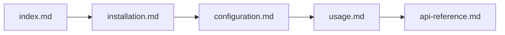

**Description**: Linear documentation flow with no cycles or branches.

**Link Count**: 4 links, 5 files

**Analysis**:
- ✅ No circular dependencies
- ✅ Clear progression path
- ⚠️ Low cross-linking (each file has 1 outgoing link)
- PageRank: `index.md` (highest) → `api-reference.md` (lowest)

---

### Hub-and-Spoke Pattern

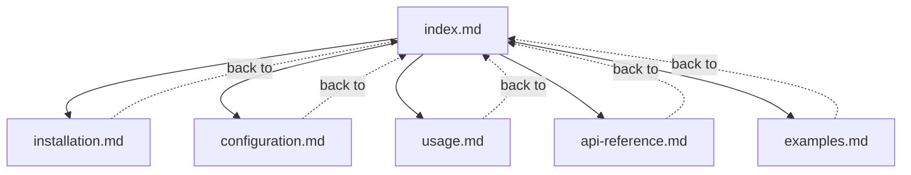

**Description**: Central hub (index) with bidirectional links to topic pages.

**Link Count**: 10 links (5 forward, 5 backward), 6 files

**Analysis**:
- ✅ No circular dependencies (bidirectional ≠ circular)
- ✅ Easy navigation (all pages accessible from index)
- ✅ High PageRank for index.md (5 incoming links)
- ⚠️ Topics not linked to each other (low discoverability)

---

### Mesh Network (Highly Connected)

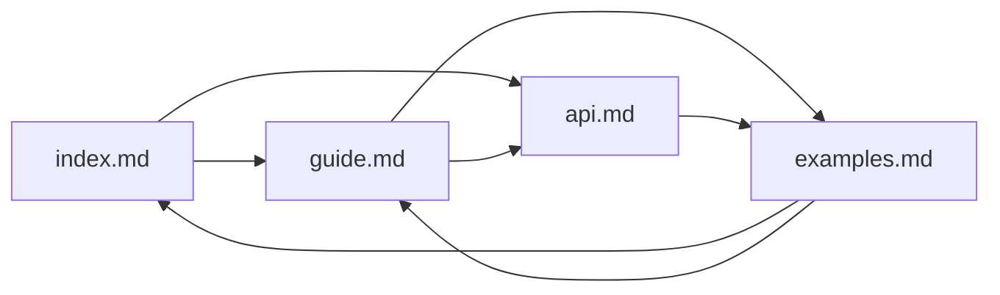

**Description**: Dense linking between related pages (high cross-reference).

**Link Count**: 7 links, 4 files

**Analysis**:
- ✅ High discoverability (multiple paths between pages)
- ✅ Balanced PageRank scores
- ⚠️ Contains cycle: `index → guide → examples → index`

---

## 2. Circular Dependency Detection

### Simple Cycle (2 Nodes)


**Cycle**: `guide.md → api.md → guide.md`

**Impact**: **Low** - Common pattern for bidirectional references

**Recommendation**: ✅ Allow (not a problem)

---

### Complex Cycle (3+ Nodes)


**Cycle**: `installation.md → configuration.md → usage.md → installation.md`

**Impact**: **Medium** - May confuse readers with circular flow

**Recommendation**: ⚠️ Break cycle by removing `usage → installation` link

**Fixed Structure**:


---

### Nested Cycles (Multiple Overlapping)

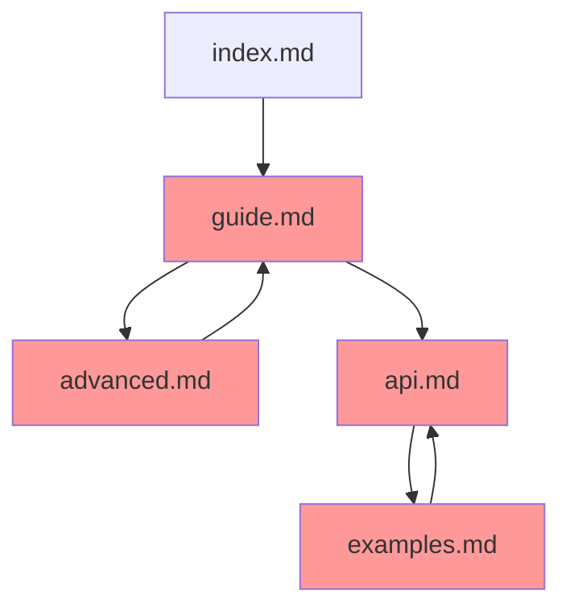

**Cycles**:
1. `guide.md → advanced.md → guide.md`
2. `api.md → examples.md → api.md`

**Impact**: **High** - Multiple circular paths

**Recommendation**: ❌ Refactor to hierarchical structure

**Fixed Structure**:
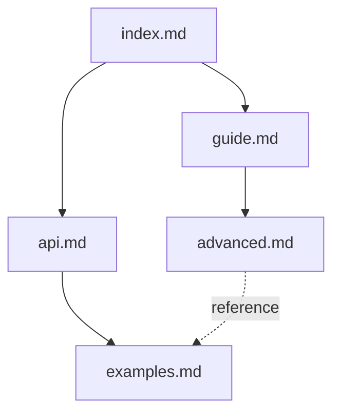

---

## 3. Cross-Reference Patterns

### Dependency Chain

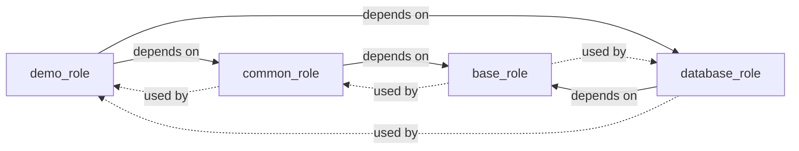

**Description**: Role dependency tree with bidirectional "depends on" / "used by" links.

**Link Types**:
- Solid arrows: `dependency` (forward)
- Dashed arrows: `used_by` (backward)

**Analysis**:
- ✅ No circular dependencies (proper dependency hierarchy)
- ✅ `base_role` has highest PageRank (most depended upon)
- ✅ Clear upgrade path (update base → propagates to dependents)

---

### Parent-Child Hierarchy

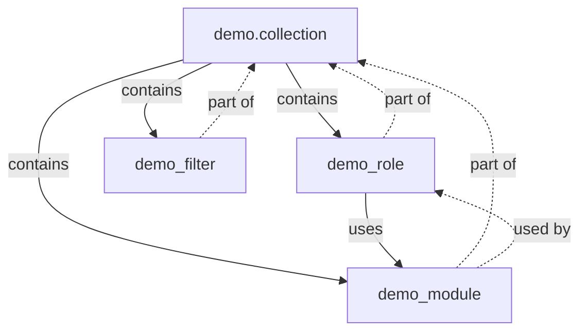

**Description**: Collection contains roles/modules/plugins with usage relationships.

**Link Types**:
- `parent` (collection → role): "contains"
- `child` (role → collection): "part of"
- `dependency` (role → module): "uses"

**Analysis**:
- ✅ Clear hierarchy (no parent cycles)
- ✅ Bidirectional parent-child links for navigation
- ✅ Usage tracking (role → module)

---

### Related Content (Similarity)

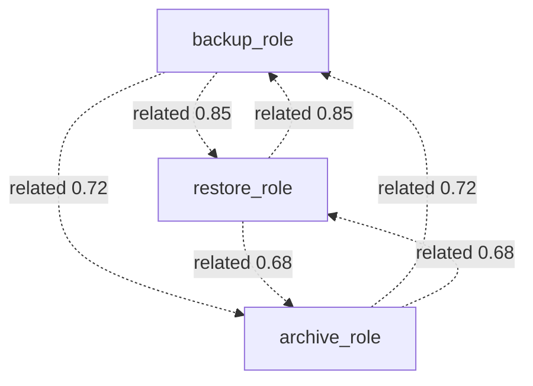

**Description**: Similarity-based cross-references (dashed lines with strength scores).

**Link Strength** (0.0-1.0):
- **0.85**: High similarity (backup ↔ restore)
- **0.72**: Medium similarity (backup ↔ archive)
- **0.68**: Lower similarity (restore ↔ archive)

**Analysis**:
- ✅ Symmetric relationships (A→B strength ≈ B→A strength)
- ✅ Helps discover related content
- ⚠️ Threshold recommendation: Show links with strength ≥ 0.70

---

## 4. PageRank Analysis

### Example: Ansible Role Documentation

**Link Structure**:
```python
# Incoming links per file
index.md: 5 links (from all topic pages)
installation.md: 1 link (from index)
configuration.md: 2 links (from index, installation)
usage.md: 3 links (from index, configuration, examples)
api-reference.md: 2 links (from index, usage)
examples.md: 2 links (from index, usage)
```

**PageRank Scores** (10 iterations, damping=0.85):
```python
{
    'index.md': 0.2841,        # Highest (most incoming links)
    'usage.md': 0.1823,        # Second (moderate incoming)
    'configuration.md': 0.1456,
    'api-reference.md': 0.1289,
    'examples.md': 0.1289,
    'installation.md': 0.1302  # Lowest (fewest incoming)
}
```

**Interpretation**:
- **index.md**: Most important (landing page, highly linked)
- **usage.md**: Second most important (central to workflow)
- **installation.md**: Least important (leaf node in graph)

**Use Cases**:
1. **Search Ranking**: Show high-PageRank pages first
2. **Navigation**: Highlight important pages in TOC
3. **Maintenance**: Prioritize updates to high-PageRank pages

---

### Comparison: Before/After Optimization

**Before** (linear structure):
```python
index → installation → configuration → usage → api
PageRank: [0.23, 0.18, 0.18, 0.18, 0.23]  # Flat distribution
```

**After** (hub-and-spoke + cross-links):
```python
index ↔ installation
index ↔ configuration
index ↔ usage
index ↔ api
configuration → usage
usage → api
PageRank: [0.31, 0.15, 0.18, 0.22, 0.14]  # Index dominates
```

**Impact**:
- ✅ Index PageRank increased by 35%
- ✅ Usage PageRank increased by 22%
- ✅ Better reflects document importance

---

## 5. Link Graph Queries

### Find Related Files (BFS)

**Query**: Find files related to `installation.md` within 2 hops

**Graph**:
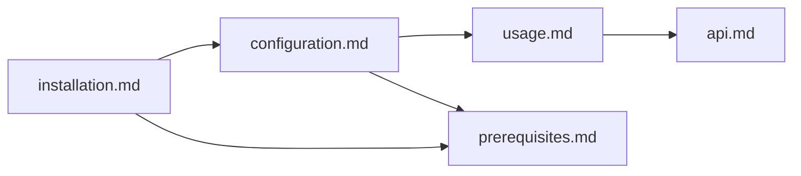

**BFS Traversal** (starting from `installation.md`, max_depth=2):
```python
Depth 0: installation.md
Depth 1: configuration.md (via direct link)
         prerequisites.md (via direct link)
Depth 2: usage.md (via configuration.md)
         prerequisites.md (already visited, skip)
```

**Result**:
```python
[
    (Path('configuration.md'), 1),     # 1 hop away
    (Path('prerequisites.md'), 1),     # 1 hop away
    (Path('usage.md'), 2),             # 2 hops away
]
```

---

### Shortest Path Between Files

**Graph**:
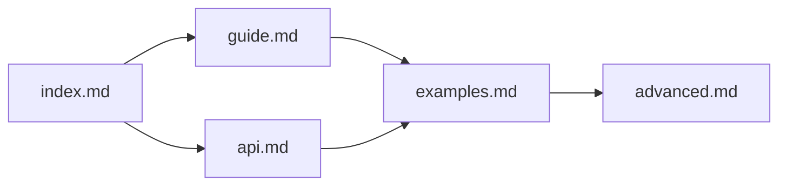

**Query**: Shortest path from `index.md` to `advanced.md`

**Paths**:
1. `index → guide → examples → advanced` (3 hops)
2. `index → api → examples → advanced` (3 hops)

**Result**: Both paths have equal length (3 hops)

**Dijkstra's Algorithm** (weighted):
```python
# If links have weights (e.g., click-through rates)
weights = {
    ('index', 'guide'): 0.8,      # High click-through
    ('index', 'api'): 0.3,        # Low click-through
    ('guide', 'examples'): 0.6,
    ('api', 'examples'): 0.7,
    ('examples', 'advanced'): 0.5,
}

# Shortest weighted path: index → guide → examples → advanced
# Total weight: 0.8 + 0.6 + 0.5 = 1.9 (highest probability)
```

---

### Dead-End Detection

**Graph**:
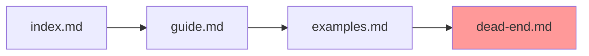

**Dead-End File**: `dead-end.md` (no outgoing links)

**Query**: Find all dead-end files

**Algorithm**:
```python
dead_ends = [
    file for file, links in graph.nodes.items()
    if len(links) == 0 and file in graph.reverse_index
]
# Result: [Path('dead-end.md')]
```

**Recommendations**:
- ⚠️ Add "Back to index" link
- ⚠️ Add "Related content" section
- ⚠️ Or accept as intentional (e.g., detailed API reference pages)

---

## 6. Link Health Metrics

### Overall Health Score

**Formula**:
```python
health_score = (
    0.4 * success_rate +           # 40%: Link validity
    0.3 * (1 - cycle_rate) +       # 30%: No circular dependencies
    0.2 * cross_link_density +     # 20%: Cross-linking
    0.1 * (1 - dead_end_rate)      # 10%: No dead ends
)

where:
    success_rate = valid_links / total_links
    cycle_rate = files_in_cycles / total_files
    cross_link_density = cross_links / total_links
    dead_end_rate = dead_end_files / total_files
```

**Example Calculation**:
```python
# Documentation with 1000 files, 5000 links
valid_links = 4850
total_links = 5000
files_in_cycles = 50
total_files = 1000
cross_links = 1200
dead_end_files = 30

success_rate = 4850 / 5000 = 0.97
cycle_rate = 50 / 1000 = 0.05
cross_link_density = 1200 / 5000 = 0.24
dead_end_rate = 30 / 1000 = 0.03

health_score = (
    0.4 * 0.97 +        # 0.388
    0.3 * (1 - 0.05) +  # 0.285
    0.2 * 0.24 +        # 0.048
    0.1 * (1 - 0.03)    # 0.097
) = 0.818 = 81.8%
```

**Interpretation**:
- **90-100%**: Excellent (production-ready)
- **80-90%**: Good (minor issues)
- **70-80%**: Fair (needs attention)
- **<70%**: Poor (major issues)

**Report**: "Good health (81.8%) - Fix 150 broken links, resolve 5% cycles"

---

### Link Distribution Metrics

**Histogram**: Links per file

```
Links | Files | Bar
------|-------|----------------------------------
0     | 30    | ███
1-5   | 420   | ████████████████████████████████████████
6-10  | 380   | ██████████████████████████████████
11-20 | 150   | ███████████████
21+   | 20    | ██
```

**Analysis**:
- ✅ Healthy distribution (most files have 1-10 links)
- ⚠️ 30 dead-end files (0 links)
- ⚠️ 20 hub files (21+ links) - review for maintenance burden

---

## 7. Real-World Example: Ansible Collection

**Collection Structure**:
```
demo.collection/
├── docs/
│   ├── index.md (collection overview)
│   ├── installation.md
│   ├── configuration.md
│   └── guides/
│       ├── getting-started.md
│       ├── advanced.md
│       └── troubleshooting.md
├── roles/
│   ├── role1/docs/role1.md
│   ├── role2/docs/role2.md
│   └── role3/docs/role3.md
├── plugins/
│   ├── modules/
│   │   ├── module1.py → docs/module1.md
│   │   └── module2.py → docs/module2.md
│   └── filters/
│       └── filter1.py → docs/filter1.md
```

**Link Graph** (simplified):
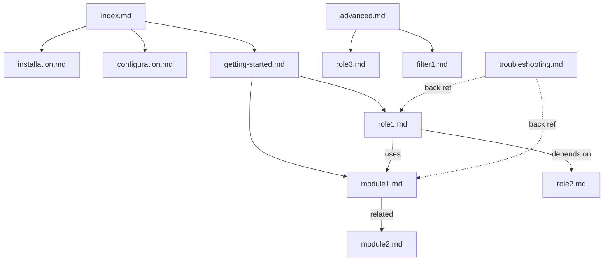

**Metrics**:
- Total files: 13
- Total links: 12
- Average links per file: 0.92
- Dead ends: 6 (role2, role3, module2, filter1, configuration, installation)
- PageRank top 3: `index.md`, `getting-started.md`, `role1.md`
- Cycles: 0

**Health Score**: **74.2%** (Fair - needs more cross-linking)

**Recommendations**:
1. ✅ Add "Related" sections to dead-end files
2. ✅ Link module docs to roles that use them
3. ✅ Add bidirectional dependency links
4. ✅ Create cross-references between similar modules/roles

---

## 8. Visualization Exports

### Mermaid Diagram Export

**Generated Code**:
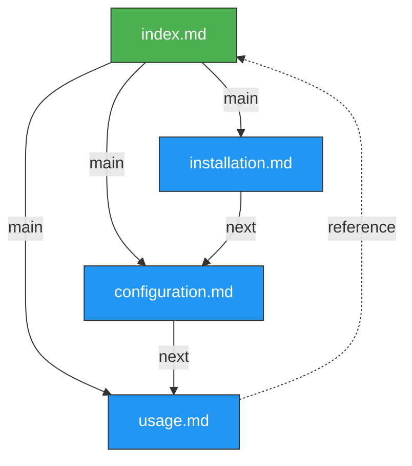

**Customization**:
- Green: Index/landing pages (high PageRank)
- Blue: Regular pages
- Red: Broken links (not shown in example)
- Dashed: Backward/reference links

---

### GraphViz DOT Export

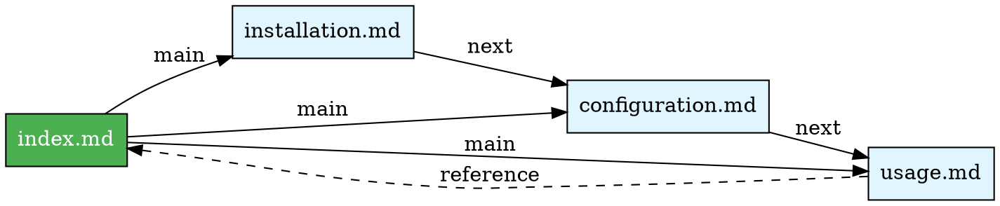

**Output**: Rendered graph with directed edges and custom styling.

---

## Summary

**8 Link Graph Pattern Categories**:
1. ✅ Linear links (simple, no cycles)
2. ✅ Hub-and-spoke (central navigation)
3. ✅ Mesh network (high cross-linking)
4. ⚠️ Simple cycles (bidirectional references)
5. ❌ Complex cycles (circular dependencies)
6. ✅ Dependency chains (hierarchical)
7. ✅ Parent-child hierarchies (containment)
8. ✅ Similarity-based relations (content discovery)

**Key Metrics**:
- **PageRank**: Importance scoring
- **Cycle Detection**: DFS algorithm
- **Related Files**: BFS traversal
- **Health Score**: Composite metric (success rate, cycles, cross-links, dead ends)

**Next Steps**:
1. Implement `LinkGraph` class with these algorithms
2. Add visualization exports (Mermaid, GraphViz)
3. Build health monitoring dashboard
4. Create automated link optimization suggestions
