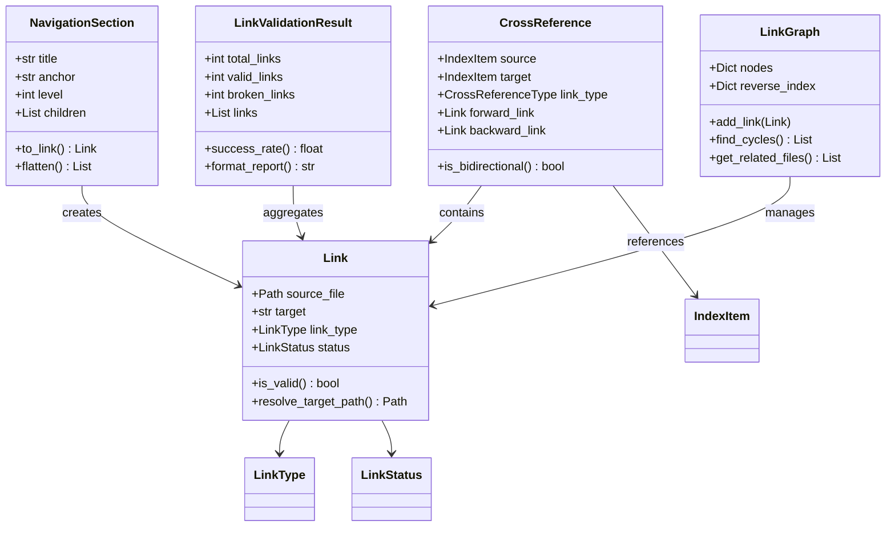
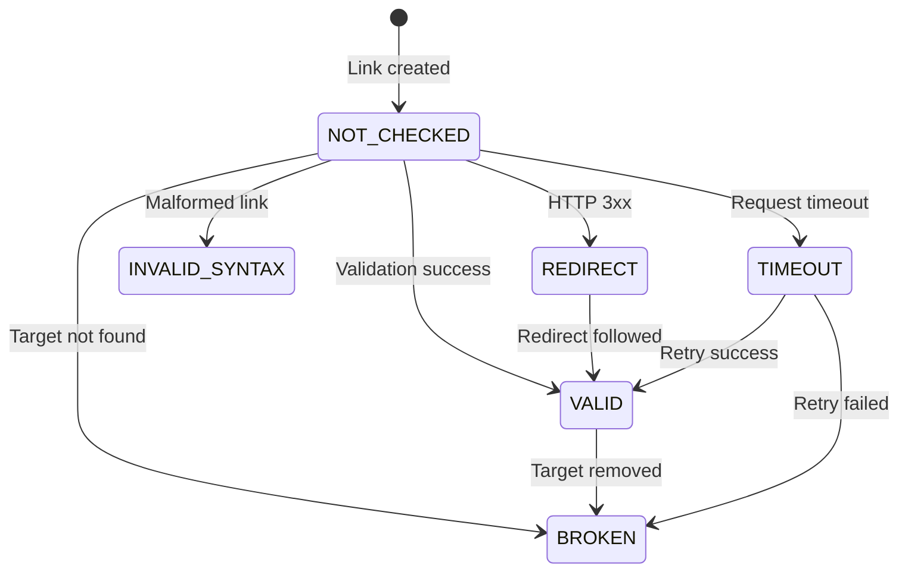

# Data Model Design
## Spec 013: Links & Cross-References

This document defines the data models, relationships, and validation rules for the Links & Cross-References feature.

---

## Core Models

### 1. Link (Base Model)

**Purpose**: Represents any link in documentation (internal file, section anchor, external URL, or cross-reference).

**Model Definition**:
```python
from enum import Enum
from datetime import datetime
from pathlib import Path
from pydantic import BaseModel, Field, field_validator
import re

class LinkType(str, Enum):
    """Types of links in documentation."""
    INTERNAL_FILE = "internal_file"          # Link to another doc file
    INTERNAL_SECTION = "internal_section"    # Anchor link within same file
    CROSS_REFERENCE = "cross_reference"      # Link to related content
    EXTERNAL_URL = "external_url"            # External HTTP/HTTPS link
    RELATIVE_PATH = "relative_path"          # Relative file path
    ABSOLUTE_PATH = "absolute_path"          # Absolute file path

class LinkStatus(str, Enum):
    """Link validation status."""
    VALID = "valid"                   # Link target exists and is reachable
    BROKEN = "broken"                 # Link target not found (404, file missing)
    REDIRECT = "redirect"             # Link redirects to another URL (3xx)
    TIMEOUT = "timeout"               # Link validation timed out
    INVALID_SYNTAX = "invalid_syntax" # Malformed link syntax
    NOT_CHECKED = "not_checked"       # Link not yet validated

class Link(BaseModel):
    """
    Represents a link in documentation.
    
    Attributes:
        source_file: File containing the link
        target: Link target (URL, file path, or anchor)
        link_type: Type of link (internal/external/section/cross-ref)
        text: Link text/title (display text)
        line_number: Line number in source file (for error reporting)
        status: Current validation status
        http_status: HTTP status code for external links (200, 404, etc.)
        redirect_url: Final URL after redirects (if status=REDIRECT)
        error_message: Error message if broken
        last_checked: Last validation timestamp
    """
    
    source_file: Path = Field(description="File containing the link")
    target: str = Field(description="Link target (URL, file path, or anchor)")
    link_type: LinkType = Field(description="Type of link")
    text: str | None = Field(default=None, description="Link text/title")
    line_number: int | None = Field(default=None, ge=1, description="Line number in source file")
    status: LinkStatus = Field(default=LinkStatus.NOT_CHECKED, description="Validation status")
    http_status: int | None = Field(default=None, ge=100, le=599, description="HTTP status code")
    redirect_url: str | None = Field(default=None, description="Final URL after redirects")
    error_message: str | None = Field(default=None, description="Error message if broken")
    last_checked: datetime | None = Field(default=None, description="Last validation timestamp")
    
    @property
    def is_valid(self) -> bool:
        """Check if link is valid."""
        return self.status == LinkStatus.VALID
    
    @property
    def is_external(self) -> bool:
        """Check if link is external (HTTP/HTTPS)."""
        return self.link_type == LinkType.EXTERNAL_URL
    
    @property
    def is_internal(self) -> bool:
        """Check if link is internal (file or section)."""
        return self.link_type in (
            LinkType.INTERNAL_FILE,
            LinkType.INTERNAL_SECTION,
            LinkType.RELATIVE_PATH,
            LinkType.ABSOLUTE_PATH,
        )
    
    @field_validator("target")
    @classmethod
    def validate_target(cls, v: str) -> str:
        """Validate target is not empty."""
        if not v or not v.strip():
            raise ValueError("Link target cannot be empty")
        return v.strip()
    
    @field_validator("source_file")
    @classmethod
    def validate_source_file(cls, v: Path) -> Path:
        """Ensure source_file is absolute path."""
        if not v.is_absolute():
            raise ValueError(f"source_file must be absolute path, got: {v}")
        return v
    
    @classmethod
    def from_markdown(cls, source: Path, match: re.Match, line_number: int) -> "Link":
        """
        Parse link from Markdown regex match.
        
        Args:
            source: Source file path
            match: Regex match object from pattern `[text](url)`
            line_number: Line number in source file
        
        Returns:
            Link instance
        
        Example:
            >>> import re
            >>> pattern = r'\[([^\]]+)\]\(([^\)]+)\)'
            >>> text = '[Guide](../roles/demo.md)'
            >>> match = re.search(pattern, text)
            >>> link = Link.from_markdown(Path('/docs/index.md'), match, 42)
        """
        text = match.group(1)
        target = match.group(2)
        link_type = cls._infer_link_type(target)
        
        return cls(
            source_file=source,
            target=target,
            link_type=link_type,
            text=text,
            line_number=line_number,
        )
    
    @classmethod
    def from_html(cls, source: Path, element, line_number: int) -> "Link":
        """
        Parse link from HTML anchor element.
        
        Args:
            source: Source file path
            element: BeautifulSoup anchor element (<a href="...">)
            line_number: Line number in source file
        
        Returns:
            Link instance
        """
        target = element.get("href", "")
        text = element.get_text(strip=True) or None
        link_type = cls._infer_link_type(target)
        
        return cls(
            source_file=source,
            target=target,
            link_type=link_type,
            text=text,
            line_number=line_number,
        )
    
    @staticmethod
    def _infer_link_type(target: str) -> LinkType:
        """Infer link type from target string."""
        if target.startswith(("http://", "https://")):
            return LinkType.EXTERNAL_URL
        elif target.startswith("#"):
            return LinkType.INTERNAL_SECTION
        elif target.startswith("/"):
            return LinkType.ABSOLUTE_PATH
        else:
            return LinkType.RELATIVE_PATH
    
    def resolve_target_path(self, base_dir: Path) -> Path | None:
        """
        Resolve relative link target to absolute path.
        
        Args:
            base_dir: Base directory for relative path resolution
        
        Returns:
            Absolute path or None if external link
        """
        if self.is_external:
            return None
        
        if self.link_type == LinkType.ABSOLUTE_PATH:
            return Path(self.target.lstrip("/"))
        
        # Remove anchor from target (e.g., "file.md#section" → "file.md")
        target_clean = self.target.split("#")[0]
        
        # Resolve relative to source file's parent directory
        source_dir = self.source_file.parent
        target_path = (source_dir / target_clean).resolve()
        
        return target_path
    
    def extract_anchor(self) -> str | None:
        """Extract anchor from link target (e.g., "file.md#section" → "section")."""
        if "#" not in self.target:
            return None
        return self.target.split("#", 1)[1]
    
    def format_for_output(self, format: str = "markdown") -> str:
        """
        Format link for specific output format.
        
        Args:
            format: Output format ("markdown", "html", "rst")
        
        Returns:
            Formatted link string
        """
        text = self.text or self.target
        
        if format == "markdown":
            return f"[{text}]({self.target})"
        elif format == "html":
            return f'<a href="{self._escape_html(self.target)}">{self._escape_html(text)}</a>'
        elif format == "rst":
            return f"`{text} <{self.target}>`_"
        else:
            raise ValueError(f"Unsupported format: {format}")
    
    @staticmethod
    def _escape_html(text: str) -> str:
        """Escape HTML entities."""
        return (
            text.replace("&", "&amp;")
            .replace("<", "&lt;")
            .replace(">", "&gt;")
            .replace('"', "&quot;")
        )
```

---

### 2. NavigationSection

**Purpose**: Represents a section in document navigation (table of contents).

**Model Definition**:
```python
class NavigationSection(BaseModel):
    """
    Section navigation entry for table of contents.
    
    Attributes:
        title: Section title (header text)
        anchor: URL-safe anchor (e.g., "installation-guide")
        level: Heading level (1-6 for h1-h6)
        line_number: Line number in source file
        file_path: File containing this section
        children: Nested subsections
    """
    
    title: str = Field(description="Section title")
    anchor: str = Field(description="URL-safe anchor")
    level: int = Field(ge=1, le=6, description="Heading level (1-6)")
    line_number: int = Field(ge=1, description="Line number in source file")
    file_path: Path = Field(description="File containing this section")
    children: list["NavigationSection"] = Field(default_factory=list, description="Nested subsections")
    
    @property
    def depth(self) -> int:
        """Calculate depth in navigation tree."""
        if not self.children:
            return 1
        return 1 + max(child.depth for child in self.children)
    
    @property
    def total_sections(self) -> int:
        """Count total sections including children."""
        return 1 + sum(child.total_sections for child in self.children)
    
    def to_link(self, base_url: str = "", relative_to: Path | None = None) -> Link:
        """
        Convert navigation section to Link object.
        
        Args:
            base_url: Base URL for link target
            relative_to: File to make path relative to
        
        Returns:
            Link object for this section
        """
        if relative_to:
            target_path = self.file_path.relative_to(relative_to)
            target = f"{target_path}#{self.anchor}"
        else:
            target = f"{base_url}#{self.anchor}"
        
        return Link(
            source_file=relative_to or self.file_path,
            target=target,
            link_type=LinkType.INTERNAL_SECTION,
            text=self.title,
            line_number=self.line_number,
            status=LinkStatus.VALID,
        )
    
    def flatten(self) -> list["NavigationSection"]:
        """Flatten navigation tree to list (depth-first)."""
        result = [self]
        for child in self.children:
            result.extend(child.flatten())
        return result
    
    def filter_by_level(self, max_level: int) -> "NavigationSection":
        """Filter navigation tree to only include sections up to max_level."""
        if self.level > max_level:
            return None
        
        filtered_children = [
            child.filter_by_level(max_level)
            for child in self.children
            if child.level <= max_level
        ]
        
        return NavigationSection(
            title=self.title,
            anchor=self.anchor,
            level=self.level,
            line_number=self.line_number,
            file_path=self.file_path,
            children=[c for c in filtered_children if c is not None],
        )
    
    @staticmethod
    def generate_anchor(title: str) -> str:
        """
        Generate GitHub-compatible anchor from section title.
        
        Algorithm:
        1. Lowercase
        2. Remove special chars except hyphen/underscore/space
        3. Replace spaces/underscores with hyphens
        4. Remove leading/trailing hyphens
        
        Examples:
            "Installation Guide" → "installation-guide"
            "API Reference (v2.0)" → "api-reference-v20"
            "What's New?" → "whats-new"
        """
        anchor = title.lower()
        anchor = re.sub(r'[^\w\s-]', '', anchor)  # Remove special chars
        anchor = re.sub(r'[\s_]+', '-', anchor)   # Replace spaces/underscores with hyphens
        anchor = anchor.strip('-')                # Remove leading/trailing hyphens
        return anchor
```

---

### 3. CrossReference (Extends Spec 011)

**Purpose**: Bidirectional cross-reference between documentation items.

**Model Definition**:
```python
from ansibledoctor.models.index import IndexItem  # From Spec 011

class CrossReferenceType(str, Enum):
    """Types of cross-references between documentation items."""
    DEPENDENCY = "dependency"        # A depends on B
    USED_BY = "used_by"              # A used by B (inverse of dependency)
    RELATED = "related"              # A related to B (similarity)
    PARENT = "parent"                # A is parent of B (collection → role)
    CHILD = "child"                  # A is child of B (inverse of parent)
    EXTENDS = "extends"              # A extends B (inheritance)
    IMPLEMENTS = "implements"        # A implements B (interface)

class CrossReference(BaseModel):
    """
    Bidirectional cross-reference between documentation items.
    
    Extends Spec 011 CrossReference with link management.
    
    Attributes:
        source: Source documentation item (from Spec 011 index)
        target: Target documentation item
        link_type: Type of relationship
        forward_link: Link from source to target
        backward_link: Link from target back to source (bidirectional)
        strength: Relationship strength (0.0-1.0, for similarity scoring)
        metadata: Additional relationship metadata
    """
    
    source: IndexItem = Field(description="Source documentation item")
    target: IndexItem = Field(description="Target documentation item")
    link_type: CrossReferenceType = Field(description="Type of relationship")
    forward_link: Link | None = Field(default=None, description="Link from source to target")
    backward_link: Link | None = Field(default=None, description="Link from target to source")
    strength: float = Field(default=1.0, ge=0.0, le=1.0, description="Relationship strength")
    metadata: dict[str, str] = Field(default_factory=dict, description="Additional metadata")
    
    @property
    def is_bidirectional(self) -> bool:
        """Check if cross-reference has both forward and backward links."""
        return self.forward_link is not None and self.backward_link is not None
    
    @property
    def is_valid(self) -> bool:
        """Check if both links are valid."""
        forward_valid = self.forward_link is None or self.forward_link.is_valid
        backward_valid = self.backward_link is None or self.backward_link.is_valid
        return forward_valid and backward_valid
    
    def get_reverse_type(self) -> CrossReferenceType:
        """Get reverse relationship type."""
        reverse_map = {
            CrossReferenceType.DEPENDENCY: CrossReferenceType.USED_BY,
            CrossReferenceType.USED_BY: CrossReferenceType.DEPENDENCY,
            CrossReferenceType.PARENT: CrossReferenceType.CHILD,
            CrossReferenceType.CHILD: CrossReferenceType.PARENT,
            CrossReferenceType.RELATED: CrossReferenceType.RELATED,
            CrossReferenceType.EXTENDS: CrossReferenceType.EXTENDS,
            CrossReferenceType.IMPLEMENTS: CrossReferenceType.IMPLEMENTS,
        }
        return reverse_map.get(self.link_type, self.link_type)
    
    def create_bidirectional(self) -> "CrossReference":
        """
        Create bidirectional cross-reference (reverse relationship).
        
        Returns:
            New CrossReference with source/target swapped
        """
        return CrossReference(
            source=self.target,
            target=self.source,
            link_type=self.get_reverse_type(),
            forward_link=self.backward_link,
            backward_link=self.forward_link,
            strength=self.strength,
            metadata=self.metadata,
        )
```

---

### 4. LinkValidationResult

**Purpose**: Aggregated result of link validation operation.

**Model Definition**:
```python
class LinkValidationResult(BaseModel):
    """
    Result of link validation operation.
    
    Attributes:
        total_links: Total links checked
        valid_links: Number of valid links
        broken_links: Number of broken links
        redirect_links: Number of redirected links
        external_links_checked: Number of external links validated
        links: List of all validated links
        duration_ms: Validation duration in milliseconds
        validation_timestamp: When validation was performed
        errors_by_file: Errors grouped by source file (for reporting)
    """
    
    total_links: int = Field(ge=0, description="Total links checked")
    valid_links: int = Field(ge=0, description="Number of valid links")
    broken_links: int = Field(ge=0, description="Number of broken links")
    redirect_links: int = Field(default=0, ge=0, description="Number of redirected links")
    external_links_checked: int = Field(default=0, ge=0, description="External links validated")
    links: list[Link] = Field(default_factory=list, description="All validated links")
    duration_ms: float = Field(ge=0.0, description="Validation duration (ms)")
    validation_timestamp: datetime = Field(default_factory=datetime.now, description="Validation timestamp")
    errors_by_file: dict[str, list[Link]] = Field(default_factory=dict, description="Errors grouped by file")
    
    @property
    def success_rate(self) -> float:
        """Calculate link validation success rate (0.0-1.0)."""
        return self.valid_links / self.total_links if self.total_links > 0 else 1.0
    
    @property
    def has_errors(self) -> bool:
        """Check if validation found any broken links."""
        return self.broken_links > 0
    
    def group_errors_by_file(self) -> dict[Path, list[Link]]:
        """Group broken links by source file."""
        errors = {}
        for link in self.links:
            if not link.is_valid:
                if link.source_file not in errors:
                    errors[link.source_file] = []
                errors[link.source_file].append(link)
        return errors
    
    def format_report(self, show_valid: bool = False, format: str = "text") -> str:
        """
        Generate human-readable validation report.
        
        Args:
            show_valid: Include valid links in report
            format: Report format ("text", "json", "html")
        
        Returns:
            Formatted report string
        """
        if format == "json":
            return self.model_dump_json(indent=2)
        elif format == "html":
            return self._format_html_report(show_valid)
        else:
            return self._format_text_report(show_valid)
    
    def _format_text_report(self, show_valid: bool) -> str:
        """Format text report."""
        lines = [
            "=" * 60,
            "Link Validation Report",
            "=" * 60,
            f"Total Links: {self.total_links}",
            f"Valid: {self.valid_links} ({self.success_rate:.1%})",
            f"Broken: {self.broken_links}",
            f"Redirects: {self.redirect_links}",
            f"External Links Checked: {self.external_links_checked}",
            f"Duration: {self.duration_ms:.2f}ms",
            "",
        ]
        
        if self.broken_links > 0:
            lines.append("Broken Links:")
            lines.append("-" * 60)
            errors = self.group_errors_by_file()
            for file_path, file_errors in errors.items():
                lines.append(f"\n{file_path}:")
                for link in file_errors:
                    line_info = f"  Line {link.line_number}: " if link.line_number else "  "
                    lines.append(f"{line_info}{link.target}")
                    if link.error_message:
                        lines.append(f"    Error: {link.error_message}")
        
        if show_valid and self.valid_links > 0:
            lines.append("\nValid Links:")
            lines.append("-" * 60)
            for link in self.links:
                if link.is_valid:
                    lines.append(f"  {link.source_file}: {link.target}")
        
        return "\n".join(lines)
    
    def _format_html_report(self, show_valid: bool) -> str:
        """Format HTML report (basic implementation)."""
        # TODO: Implement HTML report template
        return f"<html><body><h1>Link Validation Report</h1><p>Broken: {self.broken_links}</p></body></html>"
```

---

### 5. LinkGraph

**Purpose**: Graph data structure for link relationships and cycle detection.

**Model Definition**:
```python
class LinkGraph:
    """
    Graph data structure for link relationships.
    
    Uses adjacency list representation with bidirectional index for efficient
    queries. Supports cycle detection and related file discovery.
    
    Attributes:
        nodes: Forward index (file → outgoing links)
        reverse_index: Reverse index (file → incoming links)
    """
    
    def __init__(self):
        """Initialize empty link graph."""
        self.nodes: dict[Path, set[Link]] = {}  # File → outgoing links
        self.reverse_index: dict[Path, set[Link]] = {}  # File → incoming links
    
    def add_link(self, link: Link) -> None:
        """
        Add link to graph.
        
        Updates both forward and reverse indexes.
        
        Args:
            link: Link to add
        """
        # Add to forward index (source → target)
        if link.source_file not in self.nodes:
            self.nodes[link.source_file] = set()
        self.nodes[link.source_file].add(link)
        
        # Add to reverse index (target → source)
        target_path = link.resolve_target_path(link.source_file.parent)
        if target_path and target_path.exists():
            if target_path not in self.reverse_index:
                self.reverse_index[target_path] = set()
            self.reverse_index[target_path].add(link)
    
    def get_outgoing_links(self, file: Path) -> set[Link]:
        """Get all links originating from file."""
        return self.nodes.get(file, set())
    
    def get_incoming_links(self, file: Path) -> set[Link]:
        """Get all links pointing to file."""
        return self.reverse_index.get(file, set())
    
    def find_cycles(self) -> list[list[Link]]:
        """
        Detect circular link dependencies using DFS.
        
        Returns:
            List of cycles (each cycle is a list of links forming a loop)
        
        Algorithm:
            1. Perform DFS on graph
            2. Track node states: UNVISITED, VISITING, VISITED
            3. If VISITING node encountered → cycle detected
            4. Reconstruct cycle path from DFS stack
        """
        cycles = []
        state = {file: "UNVISITED" for file in self.nodes}
        dfs_stack = []
        
        def dfs(node: Path):
            """DFS helper function."""
            if state[node] == "VISITED":
                return
            if state[node] == "VISITING":
                # Cycle detected - reconstruct path
                cycle_start = dfs_stack.index(node)
                cycle_path = dfs_stack[cycle_start:]
                cycles.append(cycle_path)
                return
            
            state[node] = "VISITING"
            dfs_stack.append(node)
            
            for link in self.get_outgoing_links(node):
                target = link.resolve_target_path(node.parent)
                if target and target in self.nodes:
                    dfs(target)
            
            dfs_stack.pop()
            state[node] = "VISITED"
        
        for file in self.nodes:
            if state[file] == "UNVISITED":
                dfs(file)
        
        return cycles
    
    def get_related_files(
        self,
        file: Path,
        max_depth: int = 2,
    ) -> list[tuple[Path, int]]:
        """
        Find files related to given file within max_depth hops.
        
        Uses BFS to find files within max_depth links (forward or backward).
        
        Args:
            file: Starting file
            max_depth: Maximum link distance (default: 2)
        
        Returns:
            List of (file_path, distance) tuples, sorted by distance
        
        Example:
            >>> graph.get_related_files(Path("index.md"), max_depth=2)
            [(Path("guide.md"), 1), (Path("api.md"), 1), (Path("examples.md"), 2)]
        """
        from collections import deque
        
        visited = {file: 0}  # file → distance
        queue = deque([(file, 0)])  # (file, distance)
        
        while queue:
            current, dist = queue.popleft()
            
            if dist >= max_depth:
                continue
            
            # Explore outgoing links
            for link in self.get_outgoing_links(current):
                target = link.resolve_target_path(current.parent)
                if target and target not in visited:
                    visited[target] = dist + 1
                    queue.append((target, dist + 1))
            
            # Explore incoming links (bidirectional)
            for link in self.get_incoming_links(current):
                source = link.source_file
                if source not in visited:
                    visited[source] = dist + 1
                    queue.append((source, dist + 1))
        
        # Remove starting file and sort by distance
        related = [(f, d) for f, d in visited.items() if f != file]
        related.sort(key=lambda x: x[1])
        
        return related
    
    def compute_page_rank(self, iterations: int = 10, damping: float = 0.85) -> dict[Path, float]:
        """
        Compute PageRank scores for all files.
        
        PageRank measures importance based on incoming links.
        Higher score = more linked-to = more important.
        
        Args:
            iterations: Number of PageRank iterations
            damping: Damping factor (0.0-1.0)
        
        Returns:
            Dict mapping file → PageRank score
        """
        num_files = len(self.nodes)
        if num_files == 0:
            return {}
        
        # Initialize scores
        scores = {file: 1.0 / num_files for file in self.nodes}
        
        for _ in range(iterations):
            new_scores = {}
            for file in self.nodes:
                # Sum contributions from incoming links
                incoming_contrib = 0.0
                for link in self.get_incoming_links(file):
                    source = link.source_file
                    outgoing_count = len(self.get_outgoing_links(source))
                    if outgoing_count > 0:
                        incoming_contrib += scores[source] / outgoing_count
                
                # Apply PageRank formula
                new_scores[file] = (1 - damping) / num_files + damping * incoming_contrib
            
            scores = new_scores
        
        return scores
```

---

## Validation Rules

### Link Validation Rules

1. **Internal File Links**:
   - ✅ VALID: Target file exists in output directory
   - ❌ BROKEN: Target file not found
   - ⚠️ WARNING: Target file outside documentation root

2. **Section Anchor Links**:
   - ✅ VALID: Target file exists AND anchor found in file
   - ❌ BROKEN: Target file not found OR anchor not found
   - ⚠️ WARNING: Anchor case mismatch (may break on case-sensitive systems)

3. **External Links**:
   - ✅ VALID: HTTP 200 OK
   - 🔄 REDIRECT: HTTP 3xx (treat as warning, update link)
   - ❌ BROKEN: HTTP 4xx/5xx, connection timeout, DNS error
   - ⏳ TIMEOUT: Request timeout (configurable, default 10s)

4. **Relative Path Links**:
   - ✅ VALID: Resolved path exists relative to source file
   - ❌ BROKEN: Resolved path not found
   - ⚠️ WARNING: Path traversal outside documentation root (`../../../`)

### Cross-Reference Validation Rules

1. **Bidirectional References**:
   - ✅ VALID: Both forward and backward links valid
   - ⚠️ WARNING: Only forward link exists (missing backward)
   - ❌ BROKEN: Forward link broken

2. **Relationship Consistency**:
   - ✅ VALID: Reverse relationship type matches (DEPENDENCY ↔ USED_BY)
   - ❌ ERROR: Reverse type mismatch (DEPENDENCY → DEPENDENCY)

3. **Cycle Detection**:
   - ✅ VALID: No circular dependencies
   - ⚠️ WARNING: Circular cross-references detected

---

## Model Relationships



---

## Entity State Transitions

### Link Status Transitions



---

## Summary

**6 Core Models**:
1. **Link**: Base model for all link types with validation status
2. **NavigationSection**: Hierarchical TOC structure with anchor generation
3. **CrossReference**: Bidirectional relationships between documentation items
4. **LinkValidationResult**: Aggregated validation results with reporting
5. **LinkGraph**: Graph data structure for cycle detection and related files
6. **LinkStatus/LinkType Enums**: Type-safe status and type indicators

**Key Features**:
- Type-safe link representation with validation
- GitHub-compatible anchor generation
- Bidirectional cross-references (extends Spec 011)
- Cycle detection using DFS algorithm
- PageRank scoring for importance ranking
- Comprehensive validation with error reporting

**Integration Points**:
- **Spec 011 (Indexes)**: CrossReference extends IndexItem relationships
- **Spec 002 (Doc Generation)**: NavigationSection generates TOCs
- **Spec 012 (Schema)**: Validates link schemas

**Next Steps**:
1. Implement link parser utilities (Markdown/HTML/RST)
2. Build LinkValidator protocol implementation
3. Create CLI commands for link validation
4. Write comprehensive tests with fixtures
